# **Keyestudio Maker Learning Kit For Arduino**


# 1. Introduction

Want to have enormous fun? Want to DIY some projects? Want to be more creative and more imaginative? Want your child to learn science while having fun? As long as you are willing to create, dare to experience new things, have a passion for scientific experiments, this maker kit is your best customized choice! 

Maker learning kit is a DIY kit for scientific experiments based on ARDUINO. Together with controller, sensors, electronic components, you can build different DIY projects. It can not only enhance operational ability of teenagers, but also develop their imagination and creativity.

Children who are into DIY can learn electronics, physics, science knowledge and software programming while playing; teachers can use it to achieve innovative teaching; makers can use it for design verification of product prototype.

# 2. Component List

**NOTE:** KS0080 Kit doesn’t include main board; KS0081 Kit Includes V4.0 board; KS0082 KIT Includes MEGA 2560.

| **No** |        **Product Name**         | **Quantity** |                   **Picture**                    |
| :----: | :-----------------------------: | :----------: | :----------------------------------------------: |
|   1    |            LED - Red            |      10      | 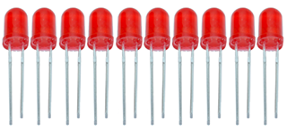  |
|   2    |          LED - Yellow           |      10      | 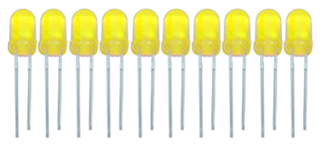  |
|   3    |           LED - Blue            |      10      | 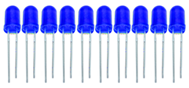  |
|   4    |           LED - Green           |      10      | 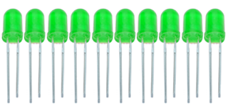  |
|   5    |            LED - RGB            |      2       |                 |
|   6    |          220Ω Resistor          |      20      |   |
|   7    |         100KΩ Resistor          |      20      | 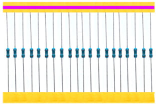  |
|   8    |          1KΩ Resistor           |      20      |   |
|   9    |         4.7KΩ Resistor          |      20      | 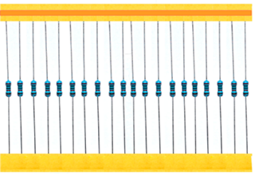  |
|   10   |          47KΩ Resistor          |      20      |   |
|   11   |          10KΩ Resistor          |      20      | 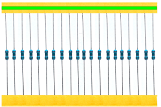  |
|   12   |      101 Ceramic Capacitor      |      10      |   |
|   13   |      103 Ceramic Capacitor      |      10      | 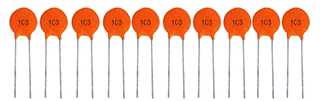  |
|   14   |      22 Ceramic Capacitor       |      10      | 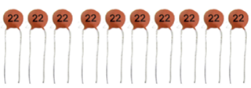  |
|   15   |      104 Ceramic Capacitor      |      10      | 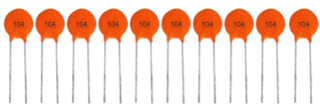  |
|   16   | 100uf16V Electrolytic Capacitor |      10      | 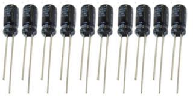  |
|   17   | 10uf16V Electrolytic capacitor  |      10      | 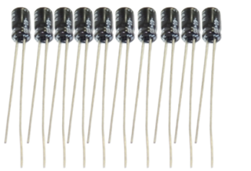  |
|   18   |             Button              |      6       | 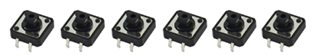  |
|   19   |        Yellow Round Cap         |      3       |   |
|   20   |         Blue Round Cap          |      3       |   |
|   21   |           4007 Diode            |      5       | 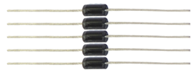  |
|   22   |  S8550 2TY TO-92 25V/0.5A PNP   |      2       | 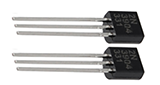  |
|   23   |    S8050 TO-92 40V/0.5A NPN     |      2       |   |
|   24   |    1-digit 7-seg LED (small)    |      1       |   |
|   25   |    4-digit 7-seg LED (small)    |      1       |   |
|   26   |       Dot Matrix (small)        |      1       |   |
|   27   |            5V Relay             |      1       | 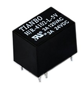  |
|   28   |          TIP122 Triode          |      1       |   |
|   29   |       Crystal Oscillator        |      1       | 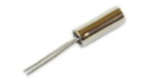  |
|   30   |           801S Sensor           |      1       |   |
|   31   |      Highly Sensitive MIC       |      1       |   |
|   32   |         Rotary Encoder          |      1       |   |
|   33   | DHT11 Temperature and Humidity  |      1       |  |
|   34   |     LM35 Temperature Sensor     |      1       |   |
|   35   |          Flame Sensor           |      1       |   |
|   36   |        Ball Tilt Sensor         |      2       |   |
|   37   |         103 Thermistor          |      1       | 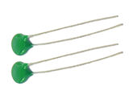  |
|   38   |          Photoresistor          |      2       | 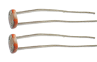  |
|   39   |      103 Variable Resistor      |      2       |   |
|   40   |              4N35               |      1       | 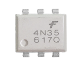  |
|   41   |             NE555P              |      1       |   |
|   42   |             DS1302              |      1       |   |
|   43   |           74HC595 IC            |      2       |   |
|   44   |          Active Buzzer          |      1       |   |
|   45   |         Passive Buzzer          |      1       |   |
|   46   |            Fan Leaf             |      1       |   |
|   47   |            Fan Motor            |      1       | 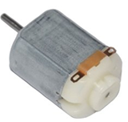  |
|   48   |         9G Servo Motor          |      1       |  |
|   49   |          I2C 1602 LCD           |      1       |  |
|   50   |          USB Cable 1m           |      1       |   |
|   51   |     Breadboard Wires 1\*65      |      1       |                 |
|   52   |   Male to Female Dupont Line    |      20      |  |
|   53   |       400-hole Breadboard       |      1       | 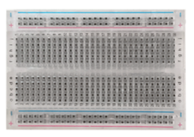  |
|   54   |    Round Head Screw M3\*6MM     |      4       |                 |
|   55   |             Chassis             |      1       | 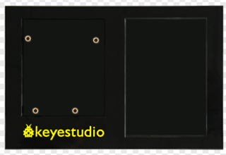  |
|   56   |         Remote Control          |      1       | 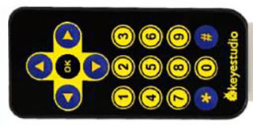  |
|   57   |          Resistor Chip          |      1       |        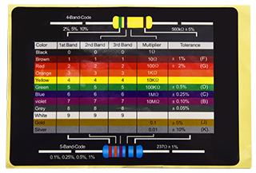         |
|   58   |         Joystick Module         |      1       |  |
|   59   |           IR Receiver           |      1       | 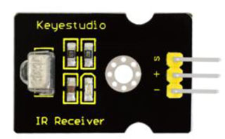 |
|   60   |        PIR Motion Sensor        |      1       | 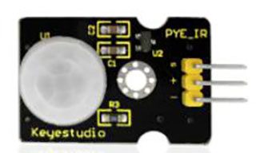 |
|   61   |          Button Module          |      1       | 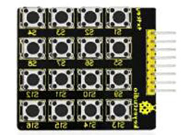 |
|   62   |         TEMT6000 Sensor         |      1       |  |
|   63   |          Steam Sensor           |      1       |  |
|   64   |        Ultrasonic Sensor        |      1       | 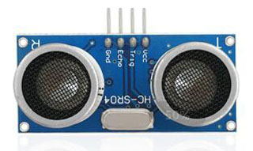 |
|   65   |         Battery Holder          |      1       |                     |

# 3.Install Arduino IDE and Driver

**Installing Arduino IDE**

When we get control board, we need to download Arduino IDE and driver firstly.

You could download Arduino IDE from the official website

[https//www.arduino.cc/](https://www.arduino.cc/), click the **SOFTWARE** on the browse bar, click “DOWNLOADS” to enter download page, as shown below

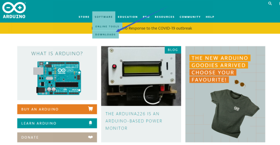

There are various versions Of IDE for Arduino, just download a version that compatible with your system, here we will show you how to download and install the windows version Arduino IDE.


There are two versions of IDE for WINDOWS system, you can choose between the Installer (.exe) and the Zip packages. We suggest you use the first one that installs directly everything you need to use the Arduino Software (IDE), including the drivers. With the Zip package you need to install the drivers manually. The Zip file is also useful if you want to create a portable installation.


You just need to click JUST DOWNLOAD.

**Keyestudio V4.0 Development Board**

We need to know keyestudio V4.0 development board, as a core of this smart car.

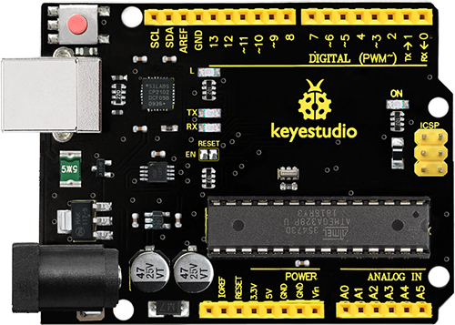

keyestudio V4.0 development board is an Arduino uno-compatible board, which is based on ATmega328P MCU, and with a cp2102 Chip as a UART-to-USB converter.


It has 14 digital input/output pins (of which 6 can be used as PWM outputs), 6 analog inputs, a 16 MHz quartz crystal, a USB connection, a power jack, 2 ICSP headers and a reset button.

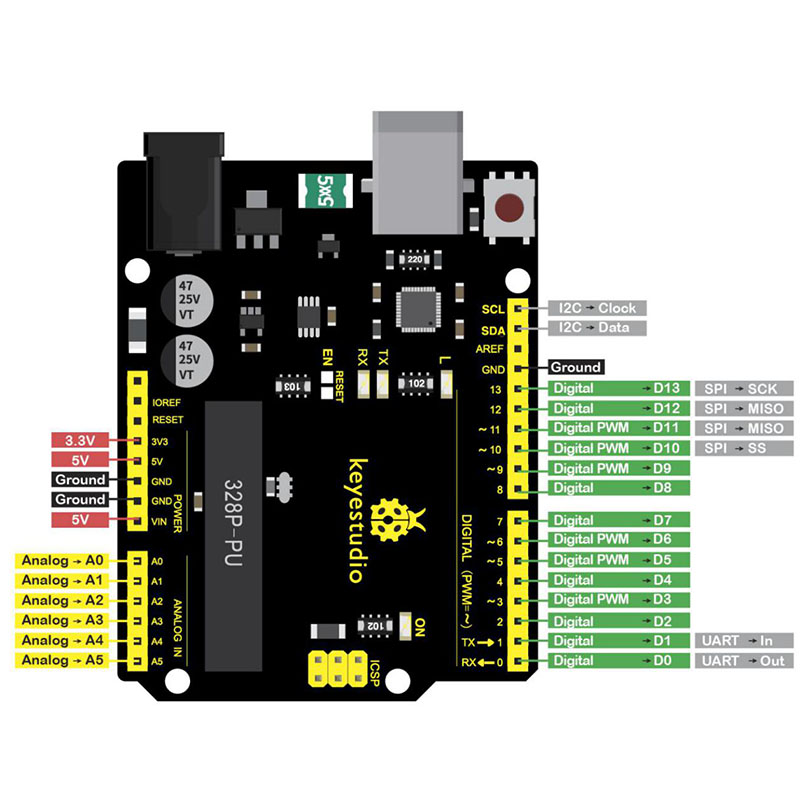  
It contains everything needed to support the microcontroller; simply connect it to a computer with a USB cable or power it via an external DC power jack (DC 7-12V) or via female headers Vin/ GND(DC 7-12V) to get started.

| Microcontroller             | ATmega328P-PU                                            |
|-----------------------------|----------------------------------------------------------|
| Operating Voltage           | 5V                                                       |
| Input Voltage (recommended) | DC7-12V                                                  |
| Digital I/O Pins            | 14 (D0-D13) (of which 6 provide PWM output)              |
| PWM Digital I/O Pins        | 6 (D3, D5, D6, D9, D10, D11)                             |
| Analog Input Pins           | 6 (A0-A5)                                                |
| DC Current per I/O Pin      | 20 mA                                                    |
| DC Current for 3.3V Pin     | 50 mA                                                    |
| Flash Memory                | 32 KB (ATmega328P-PU) of which 0.5 KB used by bootloader |
| SRAM                        | 2 KB (ATmega328P-PU)                                     |
| EEPROM                      | 1 KB (ATmega328P-PU)                                     |
| Clock Speed                 | 16 MHz                                                   |
| LED_BUILTIN                 | D13                                                      |

**keyestudio MEGA 2560 Board**

Keyestudio Mega 2560 R3 is a microcontroller board based on the ATMEGA2560-16AU, fully compatible with ARDUINO MEGA 2560 R3.


It has 54 digital input/output pins (of which 15 can be used as PWM outputs), 16 analog inputs, 4 UARTs (hardware serial ports), a 16 MHz crystal oscillator, a USB connection, a power jack, 1 ICSP header, and a reset button. The built-in ICSP port can burn the firmware for ATMEGA2560-16AU directly. This chip is burnt the firmware well before leaving the factory, therefore, we hardly use it. We can power on by USB wire, DC head and Vin GND pins. To facilitate wiring, a 0.5 m USB wire is provided for you.


Specialized Functions of Some Pins:

1\. Serial Communication: D0 (RX0) and D1 (TX0); Serial 1: D19 (RX1) and D18(TX1); Serial 2: D17 (RX2) and D16 (TX2); Serial 3: D15 (RX3) and D14 (TX3).Used to receive (RX) and transmit (TX) TTL serial data. Pins 0 and 1 are also connected to the corresponding pins of the CP2102 USB-to-TTL Serial chip.

2\. PWM Pins (Pulse-Width Modulation): D2 to D13, and D44 to D46. Provide 8-bit PWM output with the analogWrite() function.

3\. External Interrupts: D2 (interrupt 0), D3 (interrupt 1), D18 (interrupt 5),D19 (interrupt 4), D20 (interrupt 3), and D21 (interrupt 2). These pins can be configured to trigger an interrupt on a low level, a rising or falling edge, or a change in level. See the attachInterrupt() function for details.

4\. SPI communication: D53 (SS), D52 (SCK), D51 (MOSI), D50 (MISO). These pins support SPI communication using theSPI library. The SPI pins are also broken out on the ICSP header, which is physically compatible with the Arduino Uno.

5\. IIC communication: D20 (SDA); D21 (SCL). Support TWI communication using the
Wire library.

**Installing V4.0 board Driver**

Let’s install the driver of keyestudio V4.0 board. The USB-TTL chip on V4.0 board adopts CP2102 serial chip. The driver program of this chip is included in Arduino 1.8 version and above, which is convenient. Plug on USB port of board,
the computer can recognize the hardware and automatically install the driver of CP2102.

If install unsuccessfully, or you intend to install manually, open the device manager of computer. Right click Computer----- Properties----- Device Manager


There is a yellow exclamation mark on the page, which implies installing unsuccessfully. Then we double click the hardware and update the driver.


Click“OK”to enter the following page, click“browse my computer for updated driver software”, find out the installed or downloaded ARDUINO software. As shown below


There is a DRIVERS folder in Arduino software installed package（), open driver folder
and you can see the driver of CP210X series chips.

We click “Browse”, then find out the driver folder, or you could enter “driver” to search in rectangular box, then click “next”, the driver will be installed successfully. (I place Arduino software folder on the desktop, you could follow my way)


Open device manager, we will find the yellow exclamation mark disappear. The driver of CP2102 is installed successfully.


**The way to install driver of keyestudio MEGA 2560 Board is same as the driver installation of V4.0 board**

**Arduino IDE Setting**

Clickicon，open Arduino IDE.


To avoid the errors when uploading the program to the board, you need to select the correct V4.0 Board or MEGA 2650 Board that matches the board connected to your computer.

Then come back to the Arduino software, you should click Tools→Board, select the board. (as shown below)


Then select the correct COM port (you can see the corresponding COM port after the driver is successfully installed)


Before uploading the program to the board, let’s demonstrate the function of each symbol in the Arduino IDE toolbar.


A- Used to verify whether there is any compiling mistakes or not.  
		B- Used to upload the sketch to your V4.0 Board or MEGA 2650 Board.  
		C- Used to create shortcut window of a new sketch.  
		D- Used to directly open an example sketch.  
		E- Used to save the sketch.  
		F- Used to send the serial data received from board to the serial monitor.

**Start First Program**

Open the file to select Example, choose BLINK from BASIC, as shown below


Set board and COM port, the corresponding board and COM port are shown on the lower right of IDE.


Clickto start compiling the program, check errors.


Clickto upload the program, upload successfully.


Upload the program successfully, the onboard LED lights on for 1s, lights off for 1s. Congratulation, you finish the first program.

**If it is keyestudio MEGA 2560 Board, we should select Arduino MEGA or MEGA 2560**

# 4.How to Add a Library?

**What are Libraries ?**

[Libraries](https://www.arduino.cc/en/Reference/Libraries) are a collection of code that makes it easy for you to connect to a sensor,display, module, etc.

For example, the built-in LiquidCrystal library helps talk to LCD displays. There are hundreds of additional libraries available on the Internet for download.

The built-in libraries and some of these additional libraries are listed in the reference.

**How to Install a Library ?**

Here we will introduce the most simple way for you to add libraries .   Step 1After downloading well the Arduino IDE, you can right-click the icon of Arduino IDE.  Find the option "Open file location" shown as below


Step 2 Enter it to find out libraries folder, this folder is the library file of Arduino.


Step 3 Next to find out the“libraries”folder of this kit(seen in the link ).[https://www.fs.keyestudio.com/KS0080-81-82](https://www.fs.keyestudio.com/KS0080-81-82)


you just need to replicate and paste above libraries into the libraries folderof Arduino IDE. 

Then the libraries of this kit are installed successfully, as shown below  


**Note the Arduino software download and the driver installation of keyetudio
Mega 2560 R3 board is similar to arduino V4.0 board.**

# 5. Project Details

## Project 1: Hello World

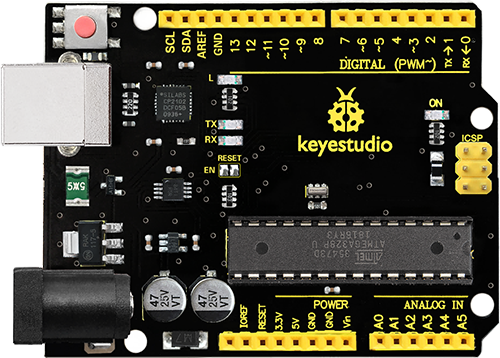

**Introduction**

As for starters, we will begin with something simple. In this project, you only need an Arduino and a USB Cable to start the "Hello World!" experiment. This is not only a communication test of your Arduino and PC, but also a primer project for you to have your first try in the Arduino world!

**Hardware Required**

V4.0 Board or MEGA 2650 Board \*1

USB Cable \*1

**Sample Code**

After installing driver for Arduino, open Arduino software and compile code that enables Arduino to print "Hello World!" under your instruction. Of course, you can compile code for Arduino to continuously echo "Hello World!" without instruction. A simple If () statement will do the instruction trick. With the onboard LED connected to pin 13, you can instruct the LED to blink first when Arduino gets an instruction and then print "Hello World!”.

```c
/*
keyestudio Maker learning kit
Project 1
Hello World
http//www.keyestudio.com
*/
int val;//define variable val
int ledpin=13;// define digital interface 13
void setup()
{
  Serial.begin(9600);// set the baud rate at 9600 to match the software set up. When connected to a specific device, (e.g. bluetooth), the baud rate needs to be the same with it.
  pinMode(ledpin,OUTPUT);// initialize digital pin 13 as output. When using I/O ports on an Arduino, this kind of set up is always needed.
}
void loop()
{
  val=Serial.read();// read the instruction or character from PC to Arduino, and assign them to Val.
  if(val=='R')// determine if the instruction or character received is “R”.
  {  // if it’s “R”,    
    digitalWrite(ledpin,HIGH);// set the LED on digital pin 13 on. 
    delay(500);
    digitalWrite(ledpin,LOW);// set the LED on digital pin 13 off.    delay(500);
    Serial.println("Hello World!");// display“Hello World！”string.
  }
}
```


**Test Result**

Click serial monitor,Input R,LED 13 will blink once,PC will receive information from Arduino: Hello World


After you choosing the right port，the experiment is very easy for you!

## Project 2: LED Blinking


**Introduction**

Blinking LED experiment is quite simple. In the "Hello World!" program, we have used LED.

This time, we are going to connect an LED to one of the digital pins rather than using LED13 which is soldered to the board. Apart from an Arduino and a USB cable, it will need extra parts as below:

**Hardware Required**

-   V4.0 Board or MEGA 2650 Board \*1

-   USB Cable \*1

-   Red M5 LED\*1

-   220Ω Resistor\*1

-   Breadboard\*1

-   Breadboard Jumper Wire \*2

**Little Knowledge**

LED is a type of semiconductor called "Light Emitting Diode "which is an electronic device made of semiconductor materials (silicon, selenium, germanium,etc.). It is dubbed indicator, digital and word display in circuit and device. It has positive and negative poles. The short leg is negative pole, the long one is positive pole.


**Resistor：**Resistor is the electronic component in the circuit, which limits and regulates current flow. Its unit is (Ω).

The units larger than ohms are kiloohms (KΩ) and megaohms (MΩ). When in use, in addition to the size of the resistance, you must also pay attention to its power. In the project, the leads at both ends of the resistor should be bent at a 90° angle to fit the breadboard properly. If the lead is too long, it can be cut to an appropriate length.


A breadboard is used to build and test circuits quickly before finalizing any circuit design. The breadboard has many holes into which circuit components like ICs and resistors can be inserted. A typical breadboard is shown below:


The bread board has strips of metal which run underneath the board and connect the holes on the top of the board. The metal strips are laid out as shown below. Note that the top and bottom rows of holes are connected horizontally while the remaining holes are connected vertically.


To use the bread board, the legs of components are placed in the holes. Each set of holes connected by a metal a strip underneath forms anode

**Circuit Connection**

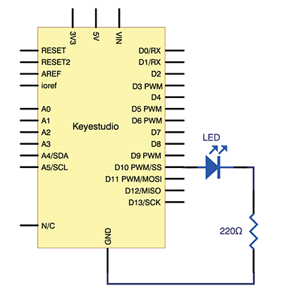

We follow below diagram from the experimental schematic link. Here we use digital pin 10. We connect LED to a 220 ohm resistor to avoid high current damaging the LED.

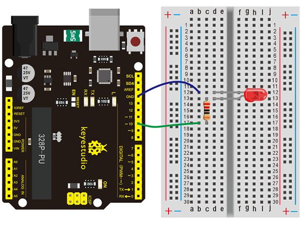

**Connection for V4.0:**

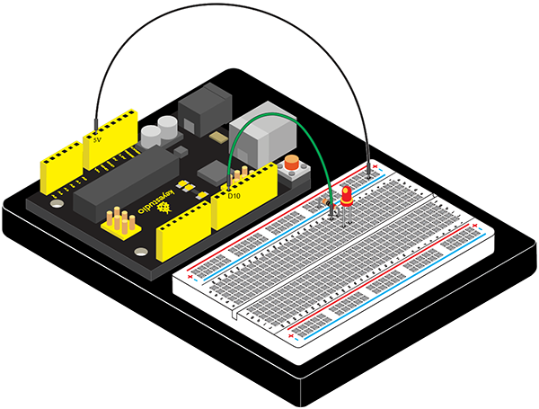

**Connection for 2560 R3:**


**Sample Code**

```c
/*
keyestudio Maker learning kit
Project 2
LED Blinking
http//www.keyestudio.com
*/

int ledPin = 10; // define digital pin 10.
void setup()
{
pinMode(ledPin, OUTPUT);// define pin with LED connected as output.
}
void loop()
{
digitalWrite(ledPin, HIGH); // set the LED on.
delay(1000); // wait for a second.
digitalWrite(ledPin, LOW); // set the LED off.
delay(1000); // wait for a second
}
```

**Test Result**

After downloading this program, in the experiment, you will see the LED connected to pin 10 turning on and off, with approximate interval of one second.

The blinking LED experiment is now completed. Thank you!

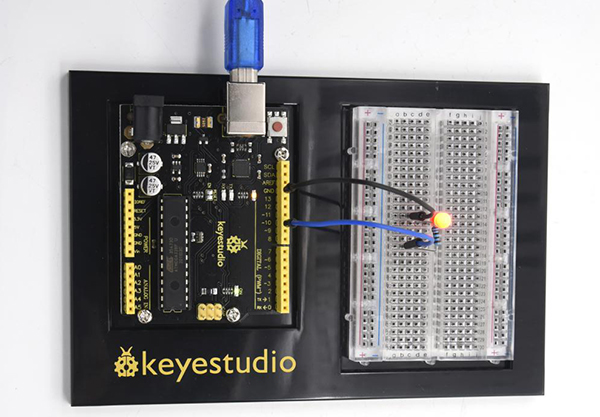

## Project 3: Breathing LED


**Introduction**

After the first two projects, I believe you’ve grown familiar with Arduino. In this project, we will use LED to do something else, simulating breath. Sounds cool? Well, let’s get on with it. We will still be using the same hardware from
project 2.

**Hardware Required**

-   V4.0 Board or MEGA 2650 Board \*1

-   USB Cable \*1

-   Red M5 LED\*1

-   220Ω Resistor\*1

-   Breadboard\*1

-   Breadboard Jumper Wire\*2

**Connection Diagram**


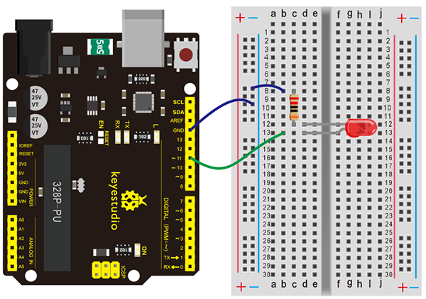

**Connection for V4.0:**


**Connection for MEGA 2560:**


**Sample Code**

```c
/*
keyestudio Maker learning kit
Project 3
Breathing LED
http//www.keyestudio.com
*/
int ledPin = 11; // define digital pin 11
void setup()
{
pinMode(ledPin, OUTPUT);// define LED pin as output
}
void loop()
{
for (int a=0; a<=255;a++)// set the LED to be brighter gradually 
{
analogWrite(ledPin,a); // turn on LED, regulate light brightness, ranging from 0-255, 255 is the brightest
delay(10); // wait for 0.01S
}
for (int a=255; a>=0;a--) // set LED to be dimming gradually
{
analogWrite(ledPin,a); // turn on LED, regulate light brightness, ranging from 0-255, 255 is the brightest
delay(10); // wait for 0.01S
}
delay(1000);// wait for 1S
}
```

**Test Result**

LED becomes brighter gradually, wait for 0.01S, then dimming gradually, wait for 1S, and then cycles on, just like the LED is breathing.

## Project 4: PWM Light Control


**Introduction**

PWM, short for Pulse Width Modulation, is a technique used to encode analog signal level into digital ones.

A computer cannot output analog voltage but only digital voltage values such as 0V or 5V. So we use a high resolution counter to encode a specific analog signal level by modulating the duty cycle of PMW.

The PWM signal is also digitalized because in any given moment, fully on DC power supply is either 5V (ON), or 0V (OFF). The voltage or current is fed to the analog load (the device that uses the power) by repeated pulse sequence
being ON or OFF. Being on, the current is fed to the load; being off, it's not. With adequate bandwidth, any analog value can be encoded using PWM. The output voltage value is calculated via the on and off time.

Output voltage = (turn on time/pulse time) \* maximum voltage value

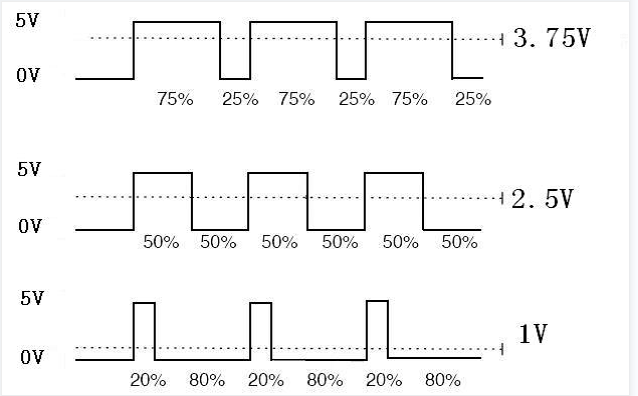

PWM has many applications: lamp brightness regulating, motor speed regulating,sound making, etc. The following are the three basic parameters of PMW:


1\. The amplitude of pulse width (minimum / maximum)

2\. The pulse period (The reciprocal of pulse frequency in 1 second)

3\. The voltage level（such as：0V-5V）

There are 6 PMW interfaces on Arduino, namely digital pin 3, 5, 6, 9, 10, and11.

In previous experiments, we have done "button-controlled LED", using digital signal to control digital pin, also one about potentiometer.

This time, we will use a potentiometer to control the brightness of the LED.

**Hardware Required**

-   V4.0 Board or MEGA 2650 Board \*1

-   USB Cable \*1

-   Potentiometer\*1

-   Red M5 LED\*1

-   220Ω Resistor\*1

-   Breadboard\*1

-   Breadboard Jumper Wire\*6

**Connection Diagram**

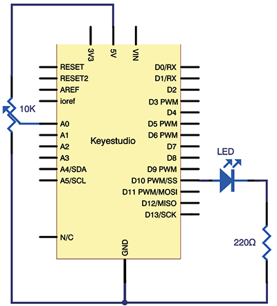

The input of potentiometer is analog, so we connect it to analog port, and LED to PWM port.Different PWM signal can regulate the brightness of the LED.

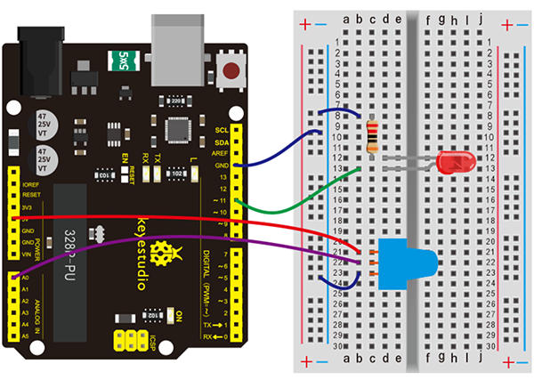

**Connection for V4.0:**

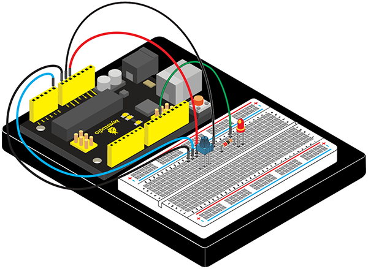

**Connection for 2560 R3:**

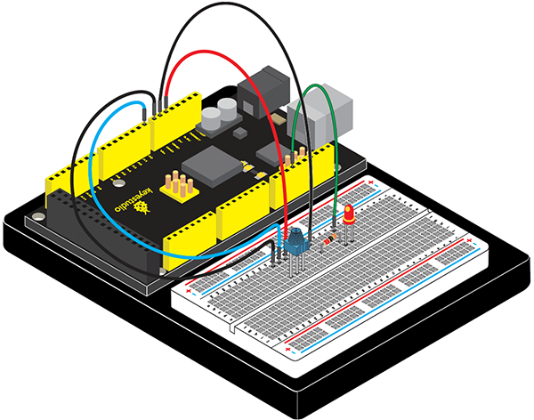

**Sample Code**

In the program compiling process, we will use the **analogWrite** (PWM interface, analog value) function.

In this experiment, we will read the analog value of the potentiometer and assign the value to PWM port, so there will be corresponding change to the brightness of the LED.

One final part will be displaying the analog value on the screen. You can consider this as the "analog value reading" project adding the PWM analog value assigning part.

Below is a Sample Code for your reference.

```c
/*
keyestudio Maker learning kit
Project 4
PWM Light Control
http//www.keyestudio.com
*/
int potpin=0;// initialize analog pin 0
int ledpin=11;//initialize digital pin 11（PWM output）
int val=0;// Temporarily store variables' value from the sensor
void setup()
{
pinMode(ledpin,OUTPUT);// define digital pin 11 as “output”
Serial.begin(9600);// set baud rate at 9600
// attention: for analog ports, they are automatically set up as “input”
}
void loop()
{
val=analogRead(potpin);// read the analog value from the sensor and assign it to val
Serial.println(val);// display value of val
analogWrite(ledpin,val/4);// turn on LED and set up brightness（maximum output of PWM is 255）
delay(10);// wait for 0.01 second
}
```

**Test Result**

After downloading the program, when we rotate the potentiometer knob, we can see changes of the displaying value, also obvious change of the LED brightness on the breadboard.


## Project 5: Traffic Light

**Introduction**

In the previous program, we have done the LED blinking experiment with one LED. Now, it’s time to up the stakes and do a bit more complicated experiment-traffic lights. Actually, these two experiments are similar. While in this traffic
lights experiment, we use 3 LEDs with different color other than 1 LED.

**Hardware Required**

-   V4.0 Board or MEGA 2650 Board \*1

-   USB Cable \*1

-   Red M5 LED\*1

-   Yellow M5 LED\*1

-   Green M5 LED\*1

-   220Ω Resistor \*3

-   Breadboard\*1

-   Breadboard Jumper Wire\*4

**Connection Diagram**

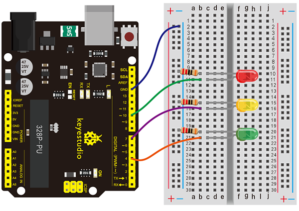

**Connection for V4.0:**


**Connection for 2560 R3:**


**Sample Code**

Since it is a simulation of traffic lights, the blinking time of each LED should be the same with those in traffic lights system.

In this program, we use Arduino **delay ()** function to control delay time, which is much simpler than C language.

```c
/*
keyestudio Maker learning kit
Project 5
Traffic Light
http//www.keyestudio.com
*/
int redled =10; // initialize digital pin 10.
int yellowled =7; // initialize digital pin 7.
int greenled =4; // initialize digital pin 4.
void setup()
{
pinMode(redled, OUTPUT);// set the pin with red LED as“output”
pinMode(yellowled, OUTPUT); // set the pin with yellow LED as“output”
pinMode(greenled, OUTPUT); // set the pin with green LED as“output”
}
void loop()
{
digitalWrite(greenled, HIGH);//// turn on green LED
delay(5000);// wait 5 seconds
digitalWrite(greenled, LOW); // turn off green LED
for(int i=0;i<3;i++)// blinks for 3 times
{
delay(500);// wait 0.5 second
digitalWrite(yellowled, HIGH);// turn on yellow LED
delay(500);// wait 0.5 second
digitalWrite(yellowled, LOW);// turn off yellow LED
} 
delay(500);// wait 0.5 second
digitalWrite(redled, HIGH);// turn on red LED
delay(5000);// wait 5 second
digitalWrite(redled, LOW);// turn off red LED
}
```

**Test Result**

When the uploading process is completed, we can see traffic lights of our own design.

The green light will be on for 5 seconds, and then off., followed by the yellow light blinking for 3 times, and then the red light on for 5 seconds, forming a cycle.

Note: this circuit design is very similar with the one in LED chase effect.

Experiment is now completed, thank you.


## Project 6: LED Chasing Effect


**Introduction**

We often see billboards composed of colorful LEDs. They are constantly changing to form various effects. In this experiment, we compile a program to simulate chase effect.

**Hardware Required**

-   V4.0 Board or MEGA 2650 Board \*1

-   USB Cable \*1

-   Red M5 LED \*6

-   220Ω Resistor \*6

-   Breadboard Jumper Wire\*7

**Connection Diagram**

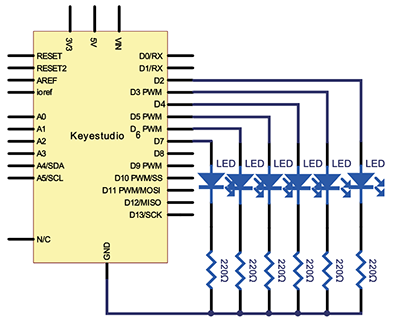

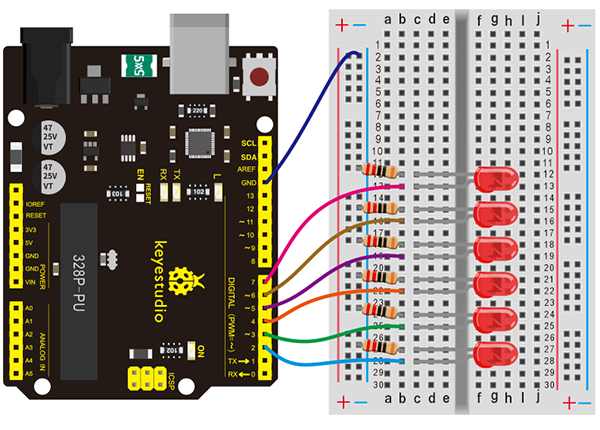

**Connection for V4.0:**


**Connection for 2560 R3:**

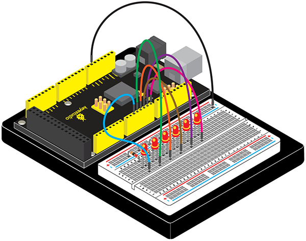

**Sample Code**

```c
/*
keyestudio Maker learning kit
Project 6
LED Chasing Effect
http//www.keyestudio.com
*/
int BASE = 2 ;  // the I/O pin for the first LED
int NUM = 6;   // number of LEDs
void setup()
{
   for (int i = BASE; i < BASE + NUM; i ++) 
   {
     pinMode(i, OUTPUT);   // set I/O pins as output
   }
}

void loop()
{
   for (int i = BASE; i < BASE + NUM; i ++) 
   {
     digitalWrite(i, LOW);    // set I/O pins as “low”, turn off LEDs one by one.
     delay(200);        // delay
   }
   for (int i = BASE; i < BASE + NUM; i ++) 
   {
     digitalWrite(i, HIGH);    // set I/O pins as “high”, turn on LEDs one by one
     delay(200);        // delay
   }  
}
```

**Test Result**

You can see the LEDs blink by sequence.

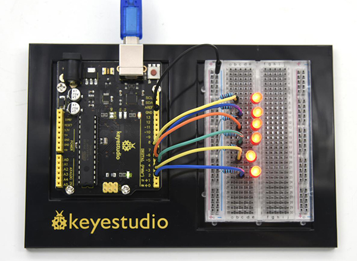

## Project 7: Button-controlled LED

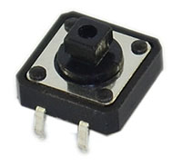

**Introduction**

I/O port means interface for INPUT and OUTPUT. Up until now, we have only used its OUTPUT function.

In this experiment, we will try to use the input function, which is to read the output value of device connecting to it. We use 1 button and 1 LED using both input and output to give you a better understanding of the I/O function.

Button switches, familiar to most of us, are a switch value (digital value) component. When it's pressed, the circuit is in closed (conducting) state.

**Hardware Required**

-   V4.0 Board or MEGA 2650 Board \*1

-   USB Cable \*1

-   Button Switch\*1

-   Red M5 LED\*1

-   220Ω Resistor\*1

-   10KΩ Resistor\*1

-   Breadboard\*1

-   Breadboard Jumper Wire\*5

**Little Knowledge**

I believe that button switch is common and popular for people. It belongs to switch quantity( digital quantity)component. Composed of normally open contact and normally closed contact,its working principle is similar with ordinary switch.

When the normally open contact bears pressure, the circuit is on state ; however, when this pressure disappears, the normally open contact goes back to initial state, that is, off state. The pressure is the act we switch the button.


**Schematic Diagrams:**

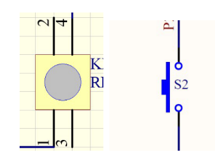

**Connection Diagram**


**Connection for V4.0:**


**Connection for 2560 R3:**


**Sample Code**

Now, let's begin the compiling. When the button is pressed, the LED will be on.After the previous study, the coding should be easy for you.

In this program, we add a statement of judgment. Here, we use an **if ()**statement.

Arduino IDE is based on C language, so statements of C language such as while, switch etc. can certainly be used for Arduino program.

When we press the button, pin 7 will output high level. We can program pin 11 to output high level and turn on the LED.

When pin 7 outputs low level, pin 11 also outputs low level and the LED remains off.

```c
/*
keyestudio Maker learning kit
Project 7
Button-controlled LED
http//www.keyestudio.com
*/
int ledpin=11;// initialize pin 11
int inpin=7;// initialize pin 7
int val;// define val
void setup()
{
pinMode(ledpin,OUTPUT);// set LED pin as “output”
pinMode(inpin,INPUT);// set button pin as “input”
}
void loop()
{
val=digitalRead(inpin);// read the level value of pin 7 and assign if to val
if(val==LOW)// check if the button is pressed, if yes, turn on the LED
{ digitalWrite(ledpin,LOW);}
else
{ digitalWrite(ledpin,HIGH);}
}
```

**Test Result**

When the button is pressed, LED is on, otherwise, LED remains off. After the above process, the button controlled LED experiment is completed.

The simple principle of this experiment is widely used in a variety of circuit and electric appliances. You can easily come across it in your every day life.One typical example is when you press a certain key of your phone, the backlight
will be on.


## Project 8: Responder


**Introduction**

After completing all the previous experiments, we believe you will find this oneeasy. In this program, we have 3 buttons and a reset button controlling the corresponding 3 LEDs, using 7 digital I/O pins.

**Hardware Required**

-   V4.0 Board or MEGA 2650 Board \*1

-   USB Cable \*1

-   Button Switch\*4

-   Red M5 LED\*1

-   Yellow M5 LED\*1

-   Green M5 LED\*1

-   220Ω Resistor\*3

-   10KΩ Resistor\*4

-   Breadboard\*1

-   Breadboard Jumper Wire\*13

**Connection Diagram**


**Connection for V4.0:**


**Connection for 2560 R3:**


**Sample Code**

```c
/*
keyestudio Maker learning kit
Project 8
Responder
http//www.keyestudio.com
*/
int redled=8;     // set red LED as “output”
int yellowled=7;  // set yellow LED as “output”
int greenled=6;   // set green LED as “output”
int redpin=5;     // initialize pin for red button
int yellowpin=4;  // initialize pin for yellow button
int greenpin=3;   // initialize pin for green button
int restpin=2;   // initialize pin for reset button
int red;
int yellow;
int green;
void setup()
{
pinMode(redled,OUTPUT);
pinMode(yellowled,OUTPUT);
pinMode(greenled,OUTPUT);
pinMode(redpin,INPUT);
pinMode(yellowpin,INPUT);
pinMode(greenpin,INPUT);
}
void loop()  // repeatedly read pins for buttons
{
red=digitalRead(redpin);
yellow=digitalRead(yellowpin);
green=digitalRead(greenpin);
if(red==LOW)RED_YES();    
if(yellow==LOW)YELLOW_YES();
if(green==LOW)GREEN_YES();
}

void RED_YES()// execute the code until red light is on; end cycle when reset button is pressed
{
  while(digitalRead(restpin)==1)
  {
   digitalWrite(redled,HIGH);
   digitalWrite(greenled,LOW);
   digitalWrite(yellowled,LOW);
  }
  clear_led();
}
void YELLOW_YES()// execute the code until yellow light is on; end cycle when reset button is pressed
{
  while(digitalRead(restpin)==1)
  {
  digitalWrite(redled,LOW);
  digitalWrite(greenled,LOW);
  digitalWrite(yellowled,HIGH);
  }
  clear_led();
}
void GREEN_YES()// execute the code until green light is on; end cycle when reset button is pressed
{
  while(digitalRead(restpin)==1)
  {
  digitalWrite(redled,LOW);
  digitalWrite(greenled,HIGH);
  digitalWrite(yellowled,LOW);
  }
  clear_led();
}
void clear_led()// all LED off
{
  digitalWrite(redled,LOW);
  digitalWrite(greenled,LOW);
  digitalWrite(yellowled,LOW);
}
```

**Test Result**

Whichever button is pressed first, the corresponding LED will be on! Then press the REST button to reset.


After the above process, we have built our own simple responder.

## Project 9: Passive Buzzer


**Introduction**

We can use Arduino to make many interactive works of which the most commonly used is acoustic-optic display. All the previous experiment has something to do with LED. However, the circuit in this experiment can produce sound. Normally, the experiment is done with a buzzer or a speaker while buzzer is simpler and easier to use.

The buzzer we introduced here is a passive buzzer. It cannot be actuated by itself, but by external pulse frequencies. Different frequencies produce different sounds. We can use Arduino to code the melody of a song, which is actually quite fun and simple.

**Hardware Required**

-   V4.0 Board or MEGA 2650 Board \*1

-   USB Cable \*1

-   Passive Buzzer\*1

-   Breadboard\*1

-   Breadboard Jumper Wire\*2

**Little knowledge**

Passive buzzer is an integrated electronic buzzer without vibration source inside. It must be driven by 2K-5K square wave instead of direct current signals. There is little difference between the two buzzers, but when the pins of the two buzzers are placed up, the passive buzzer comes with green circuit board, and the one sealed with vinyl is an active buzzer.

**Connection Diagram**


**Connection for V4.0:**


**Connection for 2560 R3:**


**Sample Code**

```c
/*
keyestudio Maker learning kit
Project 9
Passive Buzzer
http//www.keyestudio.com
*/
int buzzer=8;// select digital IO pin for the buzzer
void setup() 
{ 
pinMode(buzzer,OUTPUT);// set digital IO pin pattern, OUTPUT to be output 
} 
void loop() 
{ unsigned char i,j;//define variable
while(1) 
{ for(i=0;i<80;i++)// output a frequency sound
{ digitalWrite(buzzer,HIGH);// sound
delay(1);//delay1ms 
digitalWrite(buzzer,LOW);//not sound
delay(1);//ms delay 
} 
for(i=0;i<100;i++)// output a frequency sound
{ digitalWrite(buzzer,HIGH);// sound
digitalWrite(buzzer,LOW);//not sound
delay(2);//2ms delay 
}
} 
} 
```

**Test Result**

After connection and uploading program, the buzzer rings.

## Project 10: Photo Resistor


**Introduction**

After completing all the previous experiments, we acquired some basic understanding and knowledge about Arduino application. We have learned digital input and output, analog input and PWM.

Now, we can begin the learning of sensors applications.

Photo resistor (Photovaristor) is a resistor whose resistance varies according to different incident light strength.

It's made based on the photoelectric effect of semiconductor. If the incident light is intense, its resistance reduces; if the incident light is weak, the resistance increases.

**Hardware Required**

-   V4.0 Board or MEGA 2650 Board \*1

-   USB Cable \*1

-   Photo Resistor\*1

-   Red M5 LED\*1

-   10KΩ Resistor\*1

-   220Ω Resistor\*1

-   Breadboard\*1

-   Breadboard Jumper Wire\*5

**Little Knowledge**

Photovaristor is commonly applied in the measurement of light, light control and photovoltaic conversion (convert the change of light into the change of electricity).

Photo resistor is also being widely applied to various light control circuit,
such as light control and adjustment, optical switches, etc.


We will start with a relatively simple experiment regarding to photovaristor application.

Photovaristor is an element that can change its resistance as light strength changes. So need to read the analog value. You can refer to the PWM experiment,replacing the potentiometer with photovaristor. When there is change in light strength, it will make corresponding change on the LED.

**Connection Diagram**


**Connection for V4.0:**


**Connection for 2560 R3:**


**Sample Code**

After the connection, let's begin the program compiling. The program is similar to the one of PWM.

For change detail, please refer to the （5）Sample Code below.

```c
/*
keyestudio Maker learning kit
Project 10
Photo Resistor
http//www.keyestudio.com
*/
int potpin=0;// initialize analog pin 0, connected with photovaristor
int ledpin=11;// initialize digital pin 11, output regulating the brightness of LED
int val=0;// initialize variable va
void setup()
{
pinMode(ledpin,OUTPUT);// set digital pin 11 as “output”
Serial.begin(9600);// set baud rate at “9600”
}
void loop()
{
val= map(analogRead(potpin),0,1023,0,255);
Serial.println(val);// display the value of val
analogWrite(ledpin,val);// turn on the LED and set up brightness（maximum output value 255）
delay(10);// wait for 0.01 
}
```

**Test Result**

After downloading the program, you can change the light strength around the photovaristor and see corresponding brightness change of the LED.


Photovaristors has various applications in our everyday life. You can make other interesting interactive projects base on this one.

## Project 11: Flame Sensor


**Introduction**

Flame sensor (Infrared receiving triode) is specially used on robots to find the fire source. This sensor is of high sensitivity to flame.

**Hardware Required**

-   V4.0 Board or MEGA 2650 Board \*1

-   USB Cable \*1

-   Flame Sensor \*1

-   Active Buzzer \*1

-   10KΩ Resistor \*1

-   Breadboard Jumper Wire \*6

**Little Knowledge**

Flame sensor is based on the principle that infrared ray is highly sensitive to flame. It has an infrared receiving tube specially designed to detect fire, and then to convert the flame brightness into fluctuating level signal. The signals are then input into the central processor and be dealt with accordingly.

The shorter lead of the receiving triode is for negative, the other one for positive. Connect negative to 5V pin, positive to resistor; connect the other end of the resistor to GND, connect one end of a jumper wire to a clip which is
electrically connected to sensor positive, the other end to analog pin. As shown below


**Experiment Principle**

When it's approaching a fire, the voltage value read from the analog port will differ. If you use a multimeter, you can see that when there is no fire approaching, the voltage it reads is around 0.3V; when there is fire approaching, the voltage it reads is around 1.0V. The nearer the fire is, the higher the voltage is.   So in the beginning of the program, you can initialize voltage value **i** (no fire value); Then, continuously read the analog voltage value **j** and obtain difference value **k=j-i**; compare k with 0.6V (123 in binary) to determine whether there is a fire approaching or not; if yes, the buzzer will buzz.

**Connection Diagram**


**Connection for V4.0:**


**Connection for 2560 R3:**


**Experiment Principle**

When it's approaching a fire, the voltage value the analog port reads differs. If you use a multimeter, you can know when there is no fire approaching, the voltage it reads is around 0.3V; when there is fire approaching, the voltage it
reads is around 1.0V, the nearer the fire, the higher the voltage.  
	So in the beginning of the program, you can initialize voltage value **i** (no fire value); Then, continuously read the analog voltage value **j** and obtain difference value **k=j-i**; compare **k** with 0.6V (123 in binary) to determine whether or not there is a fire approaching; if yes, the buzzer will buzz.

**Sample Code**

```c
/*
keyestudio Maker learning kit
Project 11
Flame Sensor
http//www.keyestudio.com
*/
int flame=0;// select analog pin 0 for the sensor
 int Beep=9;// select digital pin 9 for the buzzer
 int val=0;// initialize variable
 void setup() 
{
  pinMode(Beep,OUTPUT);// set LED pin as “output”
 pinMode(flame,INPUT);// set buzzer pin as “input”
 Serial.begin(9600);// set baud rate at “9600”
 } 
void loop() 
{ 
  val=analogRead(flame);// read the analog value of the sensor 
  Serial.println(val);// output and display the analog value
  if(val>=600)// when the analog value is larger than 600, the buzzer will buzz
  {  
   digitalWrite(Beep,HIGH); 
   }else 
   {  
     digitalWrite(Beep,LOW); 
    }
   delay(500); 
}
```

**Test Result**

This program can simulate an alarm when there is a fire. Everything is normal when there is no fire; when there is, the alarm will be set off immediately.


## Project 12: Analog Temperature (Thermistor)


**Introduction**

Thermistor is a temperature measuring component based on the principle that a conductor changes in resistance with a change in its body temperature. As a result, it requires the temperature coefficient and the resistivity of the conductor to be as large and stable as possible.

It is the best that the resistance is in linear relationship with temperature. And it should also have stable physical and chemical properties in a wide range. Currently, the most used thermal resistance materials are platinum, nickel and
copper.

**Hardware Required**

-   V4.0 Board or MEGA 2650 Board \*1

-   USB Cable \*1

-   Thermistor \*1

-   10KΩ Resistor \*1

-   Breadboard \*1

-   Breadboard Jumper Wire\*3

**Little Knowledge**

This is a temperature-compensated NTC thermistor, and its resistance will change with temperature. The higher the temperature, the smaller the resistance. We can calculate the specific temperature value by reading the corresponding voltage value.

**Material:**

| Packaging Materials | Lead material     | Color |
| ------------------- | ----------------- | ----- |
| Epoxy resin         | Tinned Steel Wire | Green |

**Mode:**

| MF11                                   | 103         | M                    |
|----------------------------------------|-------------|----------------------|
| temperature-compensated NTC thermistor | Resistance  | Resistance tolerance |
|                                        | 10×103=10KΩ | ±20%                 |

**Electrical performance:**

| Project                        | symbol  | Test condition                            | unit | Performance |
|--------------------------------|---------|-------------------------------------------|------|-------------|
| 25℃ resistance                 | R 25    | Ta=25±0.05℃ Test power≤0.1mW              | KΩ   | 10±20%      |
| B                              | B 25/50 | B=[(T a ×T b )/(T b -T a )]×ln(R a /R b ) | K    | 4050±10%    |
| energy dissipation coefficient | δ       | T b =50℃±0.1℃                             | mW/℃ | about 4.5   |
| Time constant                  | τ       | T b =50℃±0.1℃                             | sec  | about 20    |
| insulation resistance          | /       | 1000V/DC 1min                             | MΩ   | ≥500        |
| Working temperature range      | /       | /                                         | ℃    | -30 \~ 125  |

**Resistance Temperature Graph:**


**Connection Diagram**


**Connection for V4.0:**


**Connection for 2560 R3:**


**Sample Code**

```c
/*
keyestudio Maker learning kit
Project 12
Analog Temperature
http//www.keyestudio.com
*/
void setup()
{
  Serial.begin(9600); //Set serial baud rate to 9600 bps
}
void loop()
{
int val;
val=analogRead(0);//Read rotation sensor value from analog 0
Serial.println(val,DEC);//Print the value to serial port
delay(100);
}
```

**Test Result**

Shown in the picture is data displayed by serial port monitor in room temperature. 


After the temperature is changed ( a bag with hot water close to thermistor ), the data changes as shown in the picture.


## Project 13: A Cup with Temperature Indicator


**Introduction**

Today, we will use Arduino to make a temperature-indicated cup. First, let’s design the circuit. When the LM35 temperature sensor senses different temperature, different LED will be turned on representing the temperature.

**Hardware Required**

-   V4.0 Board or MEGA 2650 Board \*1

-   USB Cable \*1

-   Red M5 LED\*1

-   Yellow M5 LED\*1

-   Green M5 LED\*1

-   220Ω Resistor\*3

-   LM35 Temperature Sensor \*1

-   Breadboard \*1

-   Breadboard Jumper Wire \*7

**Working Principle**

LM35 is a widely used temperature sensor with many different package types. At room temperature, it can achieve the accuracy of ±1/4°C without additional calibration processing.


LM35 temperature sensor can produce different voltage by different temperature When temperature is 0 ℃, it outputs 0V; if increasing 1 ℃, the output voltagewill increase 10 mv. The output temperature is 0℃～100℃, the conversion formula is as follows:


**Connection Diagram**


**Connection for V4.0:**


**Connection for 2560 R3:**


**Sample Code**

```c
/*
keyestudio Maker learning kit
Project 13
A Cup with Temperature Indicator
http//www.keyestudio.com
*/
void setup() {
Serial.begin(9600);
  pinMode(13, OUTPUT);
  pinMode(12, OUTPUT);
  pinMode(11, OUTPUT);
}
void loop() {
  int vol = analogRead(A0) * (5.0 / 1023.0*100);   // read temperature value of LM35
Serial.print("Tep:");
 Serial.print(vol);
 Serial.println("C");
if (vol<28)                     // low temperature area and LED setup
{
  digitalWrite(13, HIGH);
  digitalWrite(12, LOW);
  digitalWrite(11, LOW);
}
else if (vol>=28 && vol<=30)                            
 {
   digitalWrite(13, LOW);

  digitalWrite(12, HIGH);
  digitalWrite(11, LOW);
}
else if (vol>30)                               //  low temperature area and LED setup

{
   digitalWrite(13, LOW);
  digitalWrite(12, LOW);
  digitalWrite(11, HIGH);
}
 }
```

**Test Result**

Corresponding LED will be turned on in accordance with corresponding temperature range.


## Project 14: Magical Light Cup


**Introduction**

Magical light cup is a product developed by KEYES that can interact with ARDUINO. The principle is to use PWM to regulate light brightness of the two components.

Mercury switch provides digital signal, triggering PWM to regulate light brightness. Through the designed program, we can see effect like two cups pouring light to each other.

**Hardware Required**

-   V4.0 Board or MEGA 2650 Board \*1

-   USB Cable \*1

-   Ball Tilt Switch \*2

-   Red M5 LED\*2

-   220Ω Resistor \*2

-   10KΩ Resistor \*2

-   Breadboard \*1

-   Breadboard Jumper Wire \*10

**Working Principle**

When one end of the switch is below horizontal position, the switch is on. The voltage of the analog port is about 5V (1023 in binary). The LED will be on.

When the other end of the switch is below horizontal position, the switch is off. The voltage of the analog port is about 0V (0 in binary). The LED will be off.  

In the program, we determine whether the switch is on or off according to the voltage value of the analog port, whether it's above 2.5V (512 in binary) or not.

**Connection Diagram**


**Connection for V4.0:**


**Connection for 2560 R3:**


**Sample Code**

```c
/*
keyestudio Maker learning kit
Project 14
Magical Light Cup
http//www.keyestudio.com
*/
int LedPinA = 5;
int LedPinB = 6;
int ButtonPinA = 7;
int ButtonPinB = 4;
int buttonStateA = 0;
int buttonStateB = 0;
int brightnessA = 0;
int brightnessB= 255;
void setup()
{
Serial.begin(9600);
pinMode(LedPinA, OUTPUT);
pinMode(LedPinB, OUTPUT);
pinMode(ButtonPinA, INPUT);
pinMode(ButtonPinB, INPUT);
}
void loop()
{
buttonStateA = digitalRead(ButtonPinA);
if (buttonStateA == HIGH && brightnessA != 255)
{
brightnessA ++;
}
if (buttonStateA == LOW && brightnessA != 0)
{
brightnessA --;
}
analogWrite(LedPinB, brightnessA);
Serial.print(brightnessA);
Serial.print("   ");
buttonStateB = digitalRead(ButtonPinB);
if (buttonStateB == HIGH && brightnessB != 0)
{
brightnessB --;
}
if (buttonStateB == LOW && brightnessB != 255)
{
brightnessB++;
}
analogWrite(LedPinA, brightnessB); 
Serial.println(brightnessB);
delay(5);
}
```

**Test Result**

Tilt the circuit to one side, A light on, B light out; tilt to the other side, A light out, B light on.


## Project 15: Vibration Switch


**Introduction**

Vibration switch, also called vibration sensor. It is a electronic switch sensing the intensity of a vibration and transfer the （6）Test Result to the circuit device, and activate the circuit to start working.

**Hardware Required**

-   V4.0 Board or MEGA 2650 Board \*1

-   USB Cable \*1

-   Vibration Sensor\*1

-   10KΩ Resistor \*1

-   Breadboard\*1

-   Breadboard Jumper Wire\*3

**Little Knowledge**

This is a all-round and non-directional micro-vibration detection element. We could control element circuit by vibration signals.

**Specification**

1\. Micro vibration detection
2\. Non-directional
3\. Lifetime guarantee of 60 million vibrations
4\. Low power consumption with adjustable sensitivity
5\. Pure gold plating
6\. Miniature size: diameter 3.5 mm × 9.15 mm
7\. sealed package, waterproof and dustproof

**Application**

1\. Automation device

2\. Household appliance

3\. Communication products

4\. Toys

5\. Anti-theft device

6\. Automobile vibration equipment

7\. Motion-trigger products

8\. Tilt Detection

**Connection Diagram**


**Connection for V4.0:**


**Connection for 2560 R3:**


**Sample Code**

```c
/*
keyestudio Maker learning kit
Project 15
Vibration Switch
http//www.keyestudio.com
*/
#define SensorLED     13
#define SensorINPUT   2  
unsigned char state = 0; 
void setup() 
{ 
  pinMode(SensorLED, OUTPUT); 
  pinMode(SensorINPUT, INPUT);
attachInterrupt(0, blink, FALLING);//D2 as external interruption 0, when there is falling trigger and call blink function
 
}
void loop()
{
      if(state!=0)
      {
        digitalWrite(SensorLED,HIGH);
        delay(3000);
        state = 0;
      }   
      else 
        digitalWrite(SensorLED,LOW);
}  
 
void blink()// digital input of the sensor falling, triggering interruption function
{
  state++;
}
```

**Test Result**

Touch the sensor with your hand, the D13 indicator light on Arduino will be on for 3 seconds and then be out.


## Project 16: Sound-control Light


**Introduction**

In this experiment, we use sound passing through MIC to control the on and off of the light.

**Hardware Required**

-   V4.0 Board or MEGA 2650 Board \*1

-   USB Cable \*1

-   Potentiometer \*1

-   Highly Sensitive MIC \*1

-   Red M5 LED \*1

-   220Ω Resistor \*2

-   Breadboard \*1

-   Breadboard Jumper Wire\*5

**Little Knowledge**

Microphone，a kind of energy conversion element to change sound signals to electricity signals, is one of terminal of sound device.

The key element of the acoustic-electric conversion is the electret diaphragm. It is a very thin plastic film with a pure gold film on one side. Then after passing through the high-voltage electric field electret, there are opposite charges on both sides. The gold surface of the diaphragm is outward and communicates with the metal casing. The other side of the diaphragm is separated from the metal plate by a thin insulating liner. In this way, a capacitor is formed between the gold film and the metal plate. When the electret diaphragm encounters a sound wave vibration, it causes the electric field at both ends of the capacitor to change, thereby generating an alternating voltage that changes with the sound wave.

**Specification:**

Sensitivity: -56dB～-52dB (f=1KHz, S.P.L=1μBar)   Impedance: up to 2.2KΩ (f=1KHz, S.P.L=1μBar)   Current consumption: 500μA max  Working voltage: 1.0-10V  SNR: minimum 58dB (f=1KHz, S.P.L=1PaA Curve)  Maximum input sound: 115dB (f=1KHz, Distortion≤3%)

**Frequency Response Diagram**


**Connection Diagram**


**Connection for V4.0:**


**Connection for 2560 R3:**


The hardware required for this experiment is relatively simple. It has no processing of the signal from the MIC, so signal is weak and insensitive. Instead of sound signal, we blow air to the MIC.

**Sample Code**

```c
/*
keyestudio Maker learning kit
Project 16
Sound-control Light
http//www.keyestudio.com
*/
int LEDpin = 7;                 // set pin for LED 
void setup() {
  Serial.begin(9600);
  pinMode(LEDpin,OUTPUT);
}
void loop() {
  int Soundvalue = analogRead(A0);  // read the input analog value
  Serial.println(Soundvalue);
  if(Soundvalue>700)
  {
   digitalWrite(LEDpin,HIGH);      // when the analog value is bigger than the set value, turn on the LED
   for(int i=0;i<5;i++){
   delay(1000);                    // wait for 5s
   }
  }
  else{
   digitalWrite(LEDpin,LOW);      // turn off the LED 
    }
}
```

**Program description:**

By rotating the potentiometer, the analog value of A0 changes; After adjusting the potentiometer, blow air into the MIC, and observe data in the serial monitor.

For example, the displayed data is less than 300 before blowing; after blowing, data is more than 700. Setup code if (Soundvalue \> 700), control the on and off of the light; the on time of the light is controlled by the code for(int i=0;i\<5;i++) { delay(1000); }, so the light is on 5\*1s.

**Test Result**

Connect the wire according to the hardware required. Rotate the potentiometer to adjust the LED to a state where it’s between on and off .


When the light is out, data as shown in serial port monitor: 


When clapping hands, light is on for 5 seconds and data as shown below:


## Project 17: Voltmeter

**Introduction**

Today, let’s learn how to use Arduino serial communication and analog ports. We have introduced serial ports before. It can measure voltage 0-5V, and return corresponding 0-1023 value.

Today, we will use Arduino analog to make a 0-5V voltmeter.

Note: in this experiment, there is no complex protective circuit. So please do not use more than 2 cells of AA batteries whose voltage must be 0\~5V. Besides, do not use it to measure lithium battery or other power supply!

**Hardware Required**

-   V4.0 Board or MEGA 2650 Board \*1

-   USB Cable \*1

-   Voltmeter\*1

-   1KΩ Resistor \*1

-   Breadboard \*1

-   Breadboard Jumper Wire\*4

**Little Knowledge**

Control board adopts ATMEGA328P chip containing 10 bit A/D acquisition, therefore, the analog value is in the range of 0-1023. 10 bit A/D means that working voltage is divided into 1024 copies. In other words, the test accuracy is 5/1024=0.0048828125V. In fact, the voltage represented by the analog value 1023 is 5\*1023/1024=4.9951171875V, and we generally default to 5V.   When testing the voltage by analog port, the actual maximum test voltage is
4.9951171875V. When the read analog value is V0, its corresponding voltage value is V0\*(5/1024) V.

**Connection Diagram**


**Connection for V4.0:**


**Connection for 2560 R3:**


**Sample Code**

```c
/*
keyestudio Maker learning kit
Project 17
Voltmeter
http//www.keyestudio.com
*/
 float temp;   // create a floating-point type variable temp as storage space for storing data 
 void setup()
 {  
 Serial.begin(9600);     // use 9600 baud rate to have serial communication 
} 
void loop() 
{    
 int V1 = analogRead(A0);                     
// Read the voltage data from A0 port and store it in the newly created integer variables V1; measurement range of voltage from analog port is 0 to 5V; return value of 0-1023.   
float vol = V1*(5.0 / 1024.0);                
// We convert V1 value into actual voltage value and store it into floating-point variable vol   
if (vol == temp)                             
 // The judgment here is used to filter repeated data; only voltage value that is differ than the last one will be output.   
{     
temp = vol; // After comparison is completed, store the value in variable temp  
 }   
else   
{ 
Serial.print(vol);   // Serial port outputs voltage value, in the same line       
Serial.println(" V"); // Serial port outputs character V, and begin a new line    
 temp = vol;     
delay(1000);  // Wait 1 second after the output is complete for controlling the data refresh rate.  
 } 
}
```

Test Result

Click and open the serial port monitor; use the red line to measure battery positive pole, black line for negative pole. Serial monitor will refresh the voltage at 1 time/second. It is normal if there is fluctuation between two voltage values because it is, after all, a low accuracy test.


## Project 18: Rotary Encoder


**Introduction**

The rotary encoder can count the pulse outputting times during the process of its rotation in positive and reverse direction by rotating.

This rotating counting is unlimited, not like potential counting. It can be restored to initial state to count from 0 with the button on rotary encoder.

**Hardware Required**

-   V4.0 Board or MEGA 2650 Board \*1

-   USB Cable \*1

-   Rotary Encoder \*1

-   Red M5 LED\*2

-   220Ω Resistor \*2

-   10KΩ resistor\*2

-   Breadboard\*1

-   Breadboard Jumper Wire\*9

**Little Knowledge**

Rotary encoder is a speed displacement sensor that integrates opto-electromechanical technology. When the rotary encoder shaft drives the grating disc to rotate, the light emitted by the light-emitting element is cut into intermittent light by the grating disc, and received by the receiving element to generate an initial signal. After this signal is processed by the subsequent circuit, a pulse or code signal is output. It is characterized by small size, light weight, multiple varieties, complete functions, high frequency response, high resolution ability, small torque, low energy consumption, stable performance, reliable and long service life.

Output signals

In general, A and B ends of rotatory encoder stand for AC and BC terminals. We connect C end to GND

When the spindle rotates in a clockwise way, the pulse is output as shown in the figure below, and the A channel signal is ahead the B channel; when it rotates counterclockwise, the A channel signal is behind the B channel. So as to determine whether the spindle is rotating clockwise or anticlockwise.


Rotate clockwise


**Rotate anticlockwise**

**Attention: OFF means the output voltage is above 3.5V, and ON implies the output voltage is below 1.5V.**

There are A, B and C signals and S1 and S2 button signals end. In general, we connect S2 to GND to read the signals of S1 end

**Setting Method**

When in use, we pull up and add 10k resistance on button A（CLK）and B（DT）signal end, then connect to microcontroller to read the information.

C and S2 signals are linked with GND and S1 signals(SW) and signals of microcontroller. We could determine the status of rotate encoder by reading three signal ends.

**Dimension Diagram**


**Specification**

Resolution: 20 pulses/360°  Sliding noise (sudden jump): t2≤2ms  Sliding noise: above 3.5V  Contact Resistance: less than 1Ω  Insulation resistance (Insulation resistance): The resistance between the terminal and the mounting bracket is more than 10MΩ

**Connection Diagram**


**Connection for V4.0:**


**Connection for 2560 R3:**


**Sample Code**

```c
/*
keyestudio Maker learning kit
Project 18
Rotary Encoder
http//www.keyestudio.com
*/
const int interruptA = 0;       
const int interruptB = 1;       
int CLK = 2;     // PIN2
int DAT = 3;     // PIN3
int BUTTON = 4;  // PIN4
int LED1 = 5;    // PIN5
int LED2 = 6;    // PIN6
int COUNT = 0;

void setup() 
 {
  attachInterrupt(interruptA, RoteStateChanged, FALLING);
 // attachInterrupt(interruptB, buttonState, FALLING);
  pinMode(CLK, INPUT); 
  digitalWrite(2, HIGH);  // Pull High Restance  
  pinMode(DAT, INPUT); 
  digitalWrite(3, HIGH);  // Pull High Restance 
  pinMode(BUTTON, INPUT); 
  digitalWrite(4, HIGH);  // Pull High Restance
  pinMode(LED1, OUTPUT); 
  pinMode(LED2, OUTPUT); 
   Serial.begin(9600);
 }

void loop() 
{
  if  (!(digitalRead(BUTTON))) 
    {
     COUNT = 0;  
     Serial.println("STOP COUNT = 0");
     digitalWrite(LED1, LOW);
     digitalWrite(LED2, LOW);
     delay (2000);
    }
     Serial.println(COUNT);  
}

void RoteStateChanged() //When CLK  FALLING READ DAT
{
 if  (digitalRead(DAT)) // When DAT = HIGH IS FORWARD
   {
    COUNT++;
    digitalWrite(LED1, HIGH);
    digitalWrite(LED2, LOW);
    delay(20);
   }
 else                   // When DAT = LOW IS BackRote
   {
    COUNT--;
    digitalWrite(LED2, HIGH);
    digitalWrite(LED1, LOW);
    delay(20);
   }
}
```

**Test Result**

Rotate the encoder, you can control the on and off of the two LEDs.


## Project 19: 5V Relay


**Introduction**

Relay is an automatic switch element with isolation function. It's widely used in remote control, remote sensing, communication, automatic control, mechatronics and electronic devices. It is one of the most important control elements.

In summary, it has below functions:

1.  Expanding the control range: for example, when the control signal of the multicontact relay reaches a certain value, it can form different contact ways. At the same time switch on or off of multiple circuits.
    
2.  Amplification: for example, sensitive relay and intermediate relay can control circuits of large power using a small amount of controlled quantity.
    
3.  Synthetic signal: for example, when input more than one specific control signals to multiwound relay, achieve predetermined control effect after comparison and synthesis.
    
4.  Automatic, remote control and monitoring: for example, combining relay on the automatic device to other electric equipment can realize automatic operation.

**Matters needing attention**

1.  rated working voltage: refers to the normal working voltage the relay coil needs,
    
2.  Voltage control is the control circuit. It can be AC or DC voltage according to different models.
    
3.  DC resistance: refers to the DC resistance of relay coil, multimeter.

4.  Attract current: refers to the minimum current that the relay needs to generate suction action. During normal use, given current must be slightly larger than the operating current to guarantee stable operation of relay. Normally, the working voltage is 1.5 times of the coil’s. It cannot be more than the rated working voltage or coil will be burnt out due to high current.
    
5.  Release current: Refers to the maximum current for the relay to generate release action. When the suction-state current reduces to a certain point, relay will return to its unenergized release state. The current here is far less than the suction current.
    
6.  Contact switch voltage and current: refers to the load voltage and current the relay allows. This determines the magnitude of control voltage and current. Use current no high than these values or relay contact will be damaged.
    

**Hardware Required**

-   V4.0 Board or MEGA 2650 Board \*1

-   USB Cable \*1

-   4N35 \*1

-   5V Relay \*1

-   4007 Diode\*1

-   8050 Transistor \*1

-   Red M5 LED\*1

-   220Ω Resistor \*2

-   Breadboard\*1

-   Breadboard Jumper Wire \*11

**Little Knowledge**

**Coil parameters**

- Rated voltage: DC 5V
- Coil power: 0.2W
- Coil resistance (Ω ± 10% ): 125
- Rated current (mA): 40
- Maximum pull-in voltage: DC 3.75V
- Minimum release voltage: DC 0.5V
- Maximum overload voltage: DC 6.5V at 70 ℃, DC 8.5V at 23 ℃

**Contact parameters**

- Contact Form: 1H/1Z  
- Contact Form : Silver Alloy  
- Load : Resistive load(COS Ф =1)  
- Contact Ratings: AC 120V 3A /DC 24V, AC 250V 1A (TÜV)  
- Max Switching Voltag: AC 240V/DC 60V  
- Max Switching Current: 5A  
- Max Switching Power: AC 360V/90W  
- Contact Resistance: 100m Ω Max at DC 6V 1A  
- Life Expectancy: Electrical life (Electrical) 100,000 Operations (at30Operations/minute)  
- Mechanical life: 10,000,000 Operations (at300Operations/minute)

**Performance Parameters:**

- Electrical: 1,800operations/hr

- Insulation resistance: 100M Ω Min at DC 500V  
- Withstand voltage between contacts: AC 500V (for one minute)  
- Withstand voltage between contact and coil: AC 1000V (for one minute)  
- Pull-in time: 5ms  
- Release time: 5ms  
- Ambient temperature: -30 ℃ to +85 ℃  
- Impact: Action limit: 10G s Destruction limit: 50G  
- Vibration: 10-55Hz, 1.5mm  
- Maximum conversion frequency: Mechanical: 18,000operations/hr  
- Electrical:1,800operations/hr  
- Humidity: 40-85%  
- Weight: Approx 3.5g

**Design Parameters**


**Structure Picture**


**Connection Diagram**


**Connection for V4.0:**


**Connection for 2560 R3:**


**Sample Code**

```c
/*
keyestudio Maker learning kit
Project 19
5V Relay
http//www.keyestudio.com
*/
int relay = 3; // relay turn-on trigger signal - active high;
void setup ()
{
pinMode (relay, OUTPUT); //define port attribute for the output;
}
void loop ()
{
digitalWrite (relay, HIGH); // relay conducted;
delay (1000);
digitalWrite (relay, LOW); // relay switch;
delay (1000);
}
```

**Test Result**

You can have different ways to do the conduction and disconnection process. This is one way for your reference.

Here, when S is in high level, relay switches to the on end. LED will be turned on or you can switch to NC end. In the test （6）Test Result, you will see LED turning on and off in 1s interval.


## Project 20: Triode Controlled Motor Drive


**Introduction**

In this project, we use TIP122 Triode, which is an NPN Triode. Connect D3 to the triode B pole, when D3 is high level, the triode C pole and E pole are conducting, so the motor rotates.


**Hardware Required**

-   V4.0 Board or MEGA 2650 Board \*1

-   USB Cable \*1

-   TIP122 Triode\*1

-   6V Battery \*1

-   1 KΩ Resistor \*1

-   Fan Motor \*1

-   Fan Leaf \*1

-   Bread Board \*1

-   Breadboard Jumper Wires

**TIP122 Parameters:**

- Voltage: Vceo: 100V;  
- Power consumption, Pd: 65W;  
- Collector DC current: 5A;  
- DC current gain hFE: 1000;  
- Package type: TO-220;  
- Number of pins: 3;  
- Total power, Ptot: 65W;  
- Number of transistors: 1;  
- Transistor type: Power Darlington;  
- Maximum continuous current, Ic: 5A;  
- Temperature: 25°C;  
- Voltage, Vcbo: 100V;  
- Current, Ic hFE: 3A;  
- Current, Ic maximum: 5A;  
- DC current gain hfe, minimum value: 1000;  
- Surface mount devices: through-hole mounting;  
- Collector current, average value of Ic: 5A;  
- Saturation voltage, Vce sat maximum: 2V

**Connection Diagram**


**Connection for V4.0:**


**Connection for 2560 R3:**


**Sample Code**

```c
/*
keyestudio Maker learning kit
Project 20
Triode Controlled Motor Drive
http//www.keyestudio.com
*/
// the setup function runs once when you press reset or power the board
void setup() {
  // initialize digital pin 33 as an output.
  pinMode(3, OUTPUT);
}

// the loop function runs over and over again forever
void loop() {
  digitalWrite(3, HIGH);   // turn the motor on (HIGH is the voltage level)
  delay(2000);              // wait for 2 seconds
  digitalWrite(3, LOW);    // turn the motor off by making the voltage LOW
  delay(3000);              // wait for 3 second
}
```

**Test Result**

Motor rotates for 2 seconds, and stops for 3 seconds, then cycles on.


## Project 21: NE555 Timer


**Introduction**

If you ask anyone in the know to rank the most commonly and widely applied integrated circuits, the famous 555 time base integrated circuit would certainly be at the top of the list.

The 555 – a mixed circuit composed of analog and digital circuits – integrates analogue and logical functions into an independent integrated circuit, and hence tremendously expands the application range of analog integrated circuits.

The 555 is widely used in various timers, pulse generators, and oscillators. In this experiment, we will use the V4.0 board to test the frequencies of square waves generated by the 555 oscillating circuit and show them on a serial
monitor.

**Hardware Required**

-   V4.0 Board or MEGA 2650 Board \*1

-   USB Cable \*1

-   NE555 \*1

-   104 Ceramic Capacitor \*2

-   Potentiometer\*1

-   10KΩ Resistor\*1

-   Breadboard\*1

-   Breadboard Jumper Wire\*15

**NE555 Parameters**

- Supply voltage (VCC): 4.5-16 V  
- Rated working current (VCC= +5 V): 3-6 mA  
- Rated working current (VCC= +15 V): 10-15 mA  
- Maximum output current: 200 mA  
- Maximum power consumption: 600mW  
- Lowest working power consumption: 30mW (5V), 225mW (15V)  
- Temperature range: 0-70°C

**Connection Diagram**

The 555 integrated circuit was originally used as a timer, hence the name 555 time base circuit. It is now widely used in various electronic products because of its reliability, convenience, and low price.

The 555 is a complex hybrid circuit with dozens of components such as a divider, comparator, basic R-S trigger, discharge tube, and buffer.

**555 chip pins are introduced as follows:**


As shown in the picture, the 555 integrated circuit is dual in-line with the 8-pin package. Thus:

-   Pin 1 (GND): the ground;

-   Pin 2 (TRIGGER ): the input of lower comparator;

-   Pin 3 (OUTPUT): having two states of 0 and 1 decided by the input electrical level;
    
-   Pin 4 (RESET): output low level when supplied a low voltage level;

-   Pin 5 (CONTROL VOLTAGE): changing the upper and lower level trigger values;

-   Pin 6 (THRESHOLD): the input of upper comparator;

-   Pin 7 (DISCHARGE): having two states of suspension and ground connection also decided by input, and the output of the internal discharge tube;
    
-   Pin 8 (VCC): power supply.


**Connection for V4.0:**


**Connection for 2560 R3:**


**Sample Code**

```c
/*
keyestudio Maker learning kit
Project 21
NE555 Timer
http//www.keyestudio.com
*/
 int pin = 7;  //attach to the third pin of NE555
unsigned long duration;  //the variable to store the length of the pulse 
void setup()
{
  pinMode(pin, INPUT);  //set the pin as an input
  Serial.begin(9600);  // start serial port at 9600 bps:
}
 
void loop()
{
  duration = pulseIn(pin, HIGH);  //Reads a pulse on pin
  Serial.print(duration);  //print the length of the pulse on the serial monitor
  Serial.println();  //print an blank on serial monitor
  delay(500);  //wait for 500 microseconds
}	
```

**Test Result**


Burn the program into V4.0 board.

After burning the program, open the serial monitor and you will see the picture shown below.

If you rotate the potentiometer, the length of the pulse (in microsecond) displayed will change accordingly.


## Project 22: Counting Your Number


**Introduction**

The shift register operates in a fairly simple way, but can be modified to become very complicated but very useful.

We can control the shift of the register with clock pulses. As we raise the signal going to the clock pin to high, the clock is moved forward one step, and when we pull it low and high again it shifts another.

Each time we shift the clock we switch the input to a different one of the eight registers. We are essentially controlling the output of each of the eight pins one at a time, and as we move one clock signal forward, we switch to the next output pin to control.

The shift register can be a great tool when you are short on output pins, taking 8 outputs from only about 3 actual data inputs. It can be added to for some really complicated applications, and they can be daisy-chained together for even
more output options.

In this project, we only use three I\\O ports to control a, b, c, d, e, f, g and dp, therefor to control the segment display.

**Hardware Required**

-   V4.0 Board or MEGA 2650 Board \*1

-   USB Cable \*1

-   74HC595 IC \*1

-   1-digit 7-seg LED \*1

-   220Ω Resistor \*8

-   Breadboard\*1

-   Breadboard Jumper Wires

**1-digit LED Segment Display display principle**

LED segment display is a semiconductor light-emitting device. Its basic unit is a light-emitting diode (LED).

LED segment display can be divided into 7-segment display and 8-segment display according to the number of segments. 8-segment display has one more LED unit ( for decimal point display) than 7-segment one.

According to the wiring method of LED units, LED segment display can be divided into common anode display and common cathode display. Common anode display refers to the one that combine all the anodes of LED units into one common anode(COM).

For the common anode display, connect the common anode (COM) to +5V. When the cathode level of a certain segment is low, the segment is on; when the cathode level of a certain segment is high, the segment is off.

For the common cathode display, connect the common cathode (COM) to GND. When the anode level of a certain segment is high, the segment is on; when the anode level of a certain segment is low, the segment is off.


Each segment of the display consists of an LED. So when you use it, you also need to use a current-limiting resistor. Otherwise, LED will be burnt out.

In this experiment, we use a common cathode display. As we mentioned above, for common cathode display, connect the common cathode (COM) to GND. When the anode level of a certain segment is high, the segment is on; when the anode level of a certain segment is low, the segment is off.

**Connection Diagram**


**Connection for V4.0:**


**Connection for 2560 R3:**


**Sample Code**

```c
/*
keyestudio Maker learning kit
Project 22
Counting Your Number
http//www.keyestudio.com
*/
int latchPin = 4;
int clockPin = 5;
int dataPin = 2; //define three pins
void setup ()
{
  pinMode(latchPin,OUTPUT);
  pinMode(clockPin,OUTPUT);
  pinMode(dataPin,OUTPUT); //three pins as output
}
void loop()
{

  int a[10]={
    252,96,218,242,102,182,190,224,254,246};   //define functional array
  for(int x=0; x<10 ;x++ )                        //calculate counting function
  {
    digitalWrite(latchPin,LOW);
    shiftOut(dataPin,clockPin,MSBFIRST,a[x]);     //display array a[x]
    digitalWrite(latchPin,HIGH);
    delay(1000);
  }
}
```

**Test Result**

After connection and uploading codes, you can count the numbers on segment display from 0 to 9.


## Project 23: Displaying Your “0”


**Introduction**

We have introduced 74HC595 shift register last project. Now, we are going to learn 8\*8 dot matrix. It consists of 64 LEDs, located in every crossing of each row and column. When a row is at level 1, and a column at level 0 simultaneously, LED lights up that is between high and low level.

For instance, if you want to light up the first LED, connect pin 7 to high level, and pin A to low level; if you want to light up LEDs in first row, connect pin 7 to high level, and pin A, B, C, D, E, F, G, H to low level; if you want to light up LEDs in first column, connect pin A to high level, and pin 0, 1, 2, 3, 4, 5, 6, 7 to low level shown as below future.

**Hardware Required**

-   V4.0 Board or MEGA 2650 Board \*1

-   USB Cable \*1

-   LED Matrix\*1

-   220Ω Resistor \*8

-   Breadboard\*1

-   Breadboard Jumper Wires

**The display principle of the 8\*8 dot-matrix**

The external view of a dot-matrix is shown as follow:


The 8\*8 dot-matrix is made up of sixty-four LEDs, and each LED is placed at the cross point of a row and a column.

When the electrical level of a certain row is 1 and the electrical level of a certain column is 0, the corresponding LED will lighten. If you want to light the LED on the first dot, you should set pin 9 to high level and pin 13 to low level.

If you want to light LEDs on the first row, you should set pin 9 to high level and pins 13, 3, 4, 10, 6, 11, 15 and 16 to low level.

If you want to light the LEDs on the first column, set pin 13 to low level and pins 9, 14, 8, 12, 1, 7, 2 and 5 to high level.

The internal view of a dot-matrix is shown as follows


**Connection Diagram**


**Connection for V4.0:**


**Connection for 2560 R3:**


**Sample Code**

```c
/*
keyestudio Maker learning kit
Project 23
Displaying Your “0”
http//www.keyestudio.com
*/
//define an array to store “0”
unsigned char Text[]={0x00,0x1c,0x22,0x22,0x22,0x22,0x22,0x1c};
void Draw_point(unsigned char x,unsigned char y)//draw-point function
{
   clear_();
   digitalWrite(x+2, HIGH);
   digitalWrite(y+10, LOW);
   delay(1);
}
void show_num(void)//show function and invoke draw-point function
{
  unsigned char i,j,data;
  for(i=0;i<8;i++)
  {
    data=Text[i];
    for(j=0;j<8;j++)
    {
      if(data & 0x01)Draw_point(j,i);
      data>>=1;
    }  
  }
}
void setup(){ 
int i = 0 ; 
for(i=2;i<18;i++) 
 { 
   pinMode(i, OUTPUT); 
  }  
  clear_(); 
}
void loop()
{ 
  show_num();    
} 
void clear_(void)//clear screen
{
  for(int i=2;i<10;i++)
  digitalWrite(i, LOW);
  for(int i=0;i<8;i++)
  digitalWrite(i+10, HIGH);
}
```

**Test Result**

After connection and uploading codes, the matrix is displaying your “0”.


## Project 24: Changing Numbers


**Introduction**

This is a basic, 4-digit 7-segment display - white in color. It has a common cathode.

It is necessary for it to interface resistors when controlled by Arduino, so every pin in anode end should be connected to a 220Ω resistor.

The display features one decimal point per digit. The hardware interface is twelve (two rows of six) through-hole pins, counting from 1 to 12 anticlockwise.

In this project, we make the display show changing numbers among 0000-9999.

**Hardware Required**

-   V4.0 Board or MEGA 2650 Board \*1

-   USB Cable \*1

-   4-digit 7-seg LED \*1

-   220Ω Resistor \*8

-   Breadboard \*1

-   Breadboard Jumper Wires

**The display principle of the 4-digit display**

For 4-digit display, there are 12 pins in total. When you place the decimal point downward, the pin on the lower left part is refer to as 1, the upper left part 12. Shown below.


**Connection Diagram**


**Connection for V4.0:**


**Connection for 2560 R3:**


**Sample Code**

```c
/*
keyestudio Maker learning kit
Project 24
Changing Numbers
http//www.keyestudio.com
*/
int a = 1;
int b = 2;
int c = 3;
int d = 4;
int e = 5;
int f = 6;
int g = 7;
int dp = 8;

int d4 = 9;
int d3 = 10;
int d2 = 11;
int d1 = 12;

// set variable
long n = 1230;
int x = 100;
int del = 55;    // fine adjustment for clock

void setup()
{
  pinMode(d1, OUTPUT);
  pinMode(d2, OUTPUT);
  pinMode(d3, OUTPUT);
  pinMode(d4, OUTPUT);
  pinMode(a, OUTPUT);
  pinMode(b, OUTPUT);
  pinMode(c, OUTPUT);
  pinMode(d, OUTPUT);
  pinMode(e, OUTPUT);
  pinMode(f, OUTPUT);
  pinMode(g, OUTPUT);
  pinMode(dp, OUTPUT);
}
/////////////////////////////////////////////////////////////
void loop()
{
  int a=0;
  int b=0;
  int c=0;
  int d=0;
  unsigned long currentMillis = millis();

  while(d>=0)
  {
    while(millis()-currentMillis<10)
     {
      Display(1,a);
      Display(2,b);
      Display(3,c);
      Display(4,d);
     }
    currentMillis = millis(); 
    d++;  
  if (d>9) 
  {
   c++;
   d=0;
  }
    if (c>9) 
  {
   b++;
   c=0;
  }
    if (b>9) 
  {
   a++;
   b=0;
  }
    if (a>9) 
  {
   a=0;
   b=0;
   c=0;
   d=0;
  }
  }  
}
///////////////////////////////////////////////////////////////
void WeiXuan(unsigned char n)//
{
  switch (n)
  {
    case 1:
      digitalWrite(d1, LOW);
      digitalWrite(d2, HIGH);
      digitalWrite(d3, HIGH);
      digitalWrite(d4, HIGH);
      break;
    case 2:
      digitalWrite(d1, HIGH);
      digitalWrite(d2, LOW);
      digitalWrite(d3, HIGH);
      digitalWrite(d4, HIGH);
      break;
    case 3:
      digitalWrite(d1, HIGH);
      digitalWrite(d2, HIGH);
      digitalWrite(d3, LOW);
      digitalWrite(d4, HIGH);
      break;
    case 4:
      digitalWrite(d1, HIGH);
      digitalWrite(d2, HIGH);
      digitalWrite(d3, HIGH);
      digitalWrite(d4, LOW);
      break;
    default :
      digitalWrite(d1, HIGH);
      digitalWrite(d2, HIGH);
      digitalWrite(d3, HIGH);
      digitalWrite(d4, HIGH);
      break;
  }
}
void Num_0()
{
  digitalWrite(a, HIGH);
  digitalWrite(b, HIGH);
  digitalWrite(c, HIGH);
  digitalWrite(d, HIGH);
  digitalWrite(e, HIGH);
  digitalWrite(f, HIGH);
  digitalWrite(g, LOW);
  digitalWrite(dp, LOW);
}
void Num_1()
{
  digitalWrite(a, LOW);
  digitalWrite(b, HIGH);
  digitalWrite(c, HIGH);
  digitalWrite(d, LOW);
  digitalWrite(e, LOW);
  digitalWrite(f, LOW);
  digitalWrite(g, LOW);
  digitalWrite(dp, LOW);
}
void Num_2()
{
  digitalWrite(a, HIGH);
  digitalWrite(b, HIGH);
  digitalWrite(c, LOW);
  digitalWrite(d, HIGH);
  digitalWrite(e, HIGH);
  digitalWrite(f, LOW);
  digitalWrite(g, HIGH);
  digitalWrite(dp, LOW);
}
void Num_3()
{
  digitalWrite(a, HIGH);
  digitalWrite(b, HIGH);
  digitalWrite(c, HIGH);
  digitalWrite(d, HIGH);
  digitalWrite(e, LOW);
  digitalWrite(f, LOW);
  digitalWrite(g, HIGH);
  digitalWrite(dp, LOW);
}
void Num_4()
{
  digitalWrite(a, LOW);
  digitalWrite(b, HIGH);
  digitalWrite(c, HIGH);
  digitalWrite(d, LOW);
  digitalWrite(e, LOW);
  digitalWrite(f, HIGH);
  digitalWrite(g, HIGH);
  digitalWrite(dp, LOW);
}
void Num_5()
{
  digitalWrite(a, HIGH);
  digitalWrite(b, LOW);
  digitalWrite(c, HIGH);
  digitalWrite(d, HIGH);
  digitalWrite(e, LOW);
  digitalWrite(f, HIGH);
  digitalWrite(g, HIGH);
  digitalWrite(dp, LOW);
}
void Num_6()
{
  digitalWrite(a, HIGH);
  digitalWrite(b, LOW);
  digitalWrite(c, HIGH);
  digitalWrite(d, HIGH);
  digitalWrite(e, HIGH);
  digitalWrite(f, HIGH);
  digitalWrite(g, HIGH);
  digitalWrite(dp, LOW);
}
void Num_7()
{
  digitalWrite(a, HIGH);
  digitalWrite(b, HIGH);
  digitalWrite(c, HIGH);
  digitalWrite(d, LOW);
  digitalWrite(e, LOW);
  digitalWrite(f, LOW);
  digitalWrite(g, LOW);
  digitalWrite(dp, LOW);
}
void Num_8()
{
  digitalWrite(a, HIGH);
  digitalWrite(b, HIGH);
  digitalWrite(c, HIGH);
  digitalWrite(d, HIGH);
  digitalWrite(e, HIGH);
  digitalWrite(f, HIGH);
  digitalWrite(g, HIGH);
  digitalWrite(dp, LOW);
}
void Num_9()
{
  digitalWrite(a, HIGH);
  digitalWrite(b, HIGH);
  digitalWrite(c, HIGH);
  digitalWrite(d, HIGH);
  digitalWrite(e, LOW);
  digitalWrite(f, HIGH);
  digitalWrite(g, HIGH);
  digitalWrite(dp, LOW);
}
void Clear()    // clear the screen
{
  digitalWrite(a, LOW);
  digitalWrite(b, LOW);
  digitalWrite(c, LOW);
  digitalWrite(d, LOW);
  digitalWrite(e, LOW);
  digitalWrite(f, LOW);
  digitalWrite(g, LOW);
  digitalWrite(dp, LOW);
}
void pickNumber(unsigned char n)// select number
{
  switch (n)
  {
    case 0: Num_0();

      break;
    case 1: Num_1();
      break;
    case 2: Num_2();
      break;
    case 3: Num_3();
      break;
    case 4: Num_4();
      break;
    case 5: Num_5();
      break;
    case 6: Num_6();
      break;
    case 7: Num_7();
      break;
    case 8: Num_8();
      break;
    case 9: Num_9();
      break;
    default: Clear();
      break;
  }
}
void Display(unsigned char x, unsigned char Number)//    take x as coordinate and display number
{
  WeiXuan(x);
  pickNumber(Number);
  delay(1);
  Clear() ; // clear the screen
}
```

**Test Result**

After connection and uploading code, we make the display show changing numbers among 0000-9999.


## Project 25: DHT11 Temperature and Humidity Sensor


**（1）Introduction**

This DHT11 Temperature and Humidity Sensor features calibrated digital signal output with the temperature and humidity sensor complex. Its technology ensures high reliability and excellent long-term stability. A high-performance 8-bit microcontroller is connected.

This sensor includes a resistive element and a sense of wet NTC temperature measuring devices. It has excellent quality, fast response, anti-interference ability and high cost performance advantages.

Each DHT11 sensor features extremely accurate calibration data of humidity calibration chamber. The calibration coefficients stored in the OTP program memory, internal sensors detect signals in the process, and we should call these
calibration coefficients. The single-wire serial interface system is integrated to make it quick and easy.

Qualities of small size, low power, and 20-meter signal transmission distance make it a wide applied application and even the most demanding one. Convenient connection, special packages can be provided according to users need.

**（2）Hardware Required**

-   V4.0 Board or MEGA 2650 Board \*1

-   USB Cable \*1

-   DHT11 Temperature and Humidity \*1

-   10KΩ Resistor\*1

-   Breadboard \*1

-   Breadboard Jumper Wire\*5

**（3）DHT11**

Supply Voltage +5 V

Temperature Range 0-50 °C error of ± 2 °C

Humidity 20-90% RH ± 5% RH error

**Interface digital**


**（4）Connection Diagram**


**Connection for V4.0:**


**Connection for 2560 R3:**


**（5）Sample Code**

Please download the [DHT11Lib](https://github.com/RobTillaart/Arduino/tree/master/libraries/DHTlib) firstly. Or [see the website](http://playground.arduino.cc/Main/DHTLib).

```c
/*
keyestudio Maker learning kit
Project 25
DHT11 Temperature and Humidity Sensor
http//www.keyestudio.com
*/
#include <dht11.h>
dht11 DHT;
#define DHT11_PIN 4
  
void setup(){
  Serial.begin(9600);
  Serial.println("DHT TEST PROGRAM ");
  Serial.print("LIBRARY VERSION: ");
  Serial.println(DHT11LIB_VERSION);
  Serial.println();
  Serial.println("Type,\tstatus,\tHumidity (%),\tTemperature (C)");
}
  
void loop(){
  int chk;
  Serial.print("DHT11, \t");
  chk = DHT.read(DHT11_PIN);    // READ DATA
  switch (chk){
    case DHTLIB_OK:  
                Serial.print("OK,\t"); 
                break;
    case DHTLIB_ERROR_CHECKSUM: 
                Serial.print("Checksum error,\t"); 
                break;
    case DHTLIB_ERROR_TIMEOUT: 
                Serial.print("Time out error,\t"); 
                break;
    default: 
                Serial.print("Unknown error,\t"); 
                break;
  }
 // DISPLAT DATA
  Serial.print(DHT.humidity,1);
  Serial.print(",\t");
  Serial.println(DHT.temperature,1);
  
  delay(1000);
}
```

**（6）Test Result**

After uploading the code, open the serial monitor, it will show the temperature and humidity value of current environment.


## Project 26: Driving Your Servo Motor


**（1）Introduction**

A servo motor allows for precise control of servo position. It consists of a suitable motor coupled to a sensor for position feedback. It also requires a relatively sophisticated controller, an enclosure, a PCB and gears.

There are two ways for Arduino to control the engine. This time, we directly use servo function that comes with Arduino to control the engine.

**（2）Hardware Required**

-   V4.0 Board or MEGA 2650 Board \*1

-   USB Cable \*1

-   Potentiometer\*1

-   9G Servo Motor\*1

-   Breadboard \*1

-   Breadboard Jumper Wire\*8

**（3）Servo Motor Working Principle**

The MCU outputs a signal to the servomotor. The motor has a built-in reference circuit that gives out reference signal, cycle of 20ms and width of 1.5ms. The motor compares the acquired DC bias voltage to the voltage of the potentiometer and outputs a voltage difference. The IC on the circuit board will decide the rotate direction accordingly and drive the core-less motor. The gear then pass the force to the shaft. The sensor will determine whether it has reached the commanded position according to the feedback signal.

Servo motors are used in control systems that require to have and maintain different angles. When the motor speed is definite, the gear will drive the potentiometer to rotate. When the voltage difference reduces to zero, the motor stops. Normally, the rotation angle range is among 0-180 degrees.

Servomotor comes with many specifications. But all of them have three connection wires, distinguished by brown, red, orange (different brand may have different color).

Brown one is for GND, red one for power positive, orange one for signal line.


The rotation angle of the servo motor is controlled by regulating the duty cycle of the PWM(Pulse-Width Modulation) signal.

The standard cycle of the PWM signal is 20ms（50Hz）. Theoretically, the width is distributed between 1ms-2ms. The width corresponds the rotation angle from 0° to 90°.

But note that for different brand motor, the same signal may have different rotating angle.


With some basic knowledge, let's learn how to control a servomotor. In this experiment, you only need a servo motor and several jumper wires.

**（4）Connection Diagram**


**Connection for V4.0:**


**Connection for 2560 R3:**


**（5）Sample Code**

```c
/*
keyestudio Maker learning kit
Project 26
Driving Your Servo Motor
http//www.keyestudio.com
*/
 
#include <Servo.h>
Servo myservo;//define steering engine variable
int servo =0;
void setup()
{
 Serial.begin(9600); // 9600 bps
 myservo.attach(9);//define steering engine interface（alternative 9 and 10 but just able to control 2interfaces）
}
void loop()
{
servo=map ( analogRead(0) , 0 , 1023 , 0 , 180 )  ;
Serial.println(servo ,DEC);
myservo.write(servo);//set rotating angle
delay(50);
}
```

**（6）Test Result**

After connection and uploading codes, rotate potentiometer knob to adjust the engine’s rotating angle; open serial monitor, and we can see the value of rotating angle.


## Project 27: Choosing Your Favorite Color


**（1）Introduction**

RGB LED products contain red, blue and green LED's. We like diffused RGB LEDs because their color mix inside instead of appearing as 3 distinct LEDs. Brightness of each color changes with driving voltage.

In this project, we will map analog value of joystick module at X, Y axis and potentiometer into PWM value to control LED voltage, therefore, RGB LED displaying different color.

**（2）Hardware Required**

-   V4.0 Board or MEGA 2650 Board \*1

-   USB Cable \*1

-   LED - RGB \*1

-   220Ω Resistor \*3

-   Potentiometer\*1

-   Joystick Module\*1

-   Breadboard \*1

-   Breadboard Jumper Wire\*13

**（3）Joystick Module Parameters**

- Supply Voltage: 3.3V to 5V  
- Interface: Analog x2, Digital x1  
- Rated power: 0.0125W
- Partial pressure error: 44%～56%  
- Working temperature: -10℃～70℃
- Press pressure: 740±300gf
- Contact impedance: 100mΩMax

**（4）Connection Diagram**


**Connection for V4.0:**


**Connection for 2560 R3:**


**（5）Sample Code**

```c
/*
keyestudio Maker learning kit
Project 27
Choosing Your Favorite Color
http//www.keyestudio.com
*/
  
int redpin = 11; //select the pin for the red LED
int greenpin =10;// select the pin for the green LED
int bluepin =9; // select the pin for the blue LED
int value1;
int value2;
int value3;

void setup() {
  pinMode(redpin, OUTPUT);
  pinMode(bluepin, OUTPUT);
  pinMode(greenpin, OUTPUT);
  Serial.begin(9600);
}

void loop() 
{
value1=map( analogRead(0),0,1023,0,255);
value2=map( analogRead(1),0,1023,0,255);
value3=map( analogRead(2),0,1023,0,255);
analogWrite(11, value1);
Serial.print("value1= ");
Serial.println(value1);
delay(100); 
analogWrite(10, value2);
Serial.print("value2= ");
Serial.println(value2);
delay(100); 
analogWrite(9, value3);
Serial.print("value3= ");
Serial.println(value3);
delay(100); 
}
```

**（6）Test Result**

After connection and uploading codes, open serial monitor, rotate the potentiometer, rock the joystick; then, the color of RGB LED changes with value1, value2, value3.


## Project 28: IR Remote Control


**（1）Introduction**

**What is an infrared receiver?**

The signal from the infrared remote controller is a series of binary pulse code. To avoid interference from other infrared signals during the wireless transmission, the signal is pre-modulate at a specific carrier frequency and then send out by a infrared emission diode. The infrared receiving device needs to filter out other wave and receive signal at that specific frequency and modulate it back to binary pulse code, known as demodulation.

**（2）Hardware Required**

-   V4.0 Board or MEGA 2650 Board \*1

-   USB Cable \*1

-   IR Receiver\*1

-   Red M5 LED\*2

-   Yellow M5 LED\*2

-   Green M5 LED\*2

-   220Ω Resistor \*6

-   Breadboard \*1

-   Breadboard Jumper Wire\*11

**（3）Working Principal**

The built-in receiver converts the light signal it received from the sender into feeble electrical signal. The signal will be amplified by the IC amplifier.

After automatic gain control, band-pass filtering, demodulation, wave shaping, it returns to the original code. The code is then input to the code identification circuit by the receiver's signal output pin.

The pin and the connection of the infrared receiving head

**Pin and wiring of infrared receiver**


Infrared receiver has 3 pins.  When you use it, connect VOUT to analog pin, GND to GND, VCC to +5V.

**（4）Connection Diagram**


**Connection for V4.0:**


**Connection for 2560 R3:**


**（5）Experimental Principle**

If you want to decode code of a remote controller, you must first know how it's coded. The coding method we use here is NEC protocol.

Below is a brief introduction.

**NEC protocol:**

**Features：**

(1) 8 bit address and 8 bit command length  

(2) address and command are transmitted twice for reliability  

(3) pulse distance modulation  

(4) carrier frequency of 38 KHZ  

(5) bit time of 1.125ms or 2.25ms

**Protocol is as below:**

• Definition of logical 0 and 1 is as below


• Pulse transmitted when button is pressed and immediately released


The picture above shows a typical pulse train of the NEC protocol. With this protocol the LSB is transmitted first. In this case Address \$59 and Command $16 is transmitted. A message is started by a 9ms AGC burst, which was used to
set the gain of the earlier IR receivers. This AGC burst is then followed by a 4.5ms space, which is then followed by the address and command. Address and Command are transmitted twice. The second time all bits are inverted and can be
used for verification of the received message. The total transmission time is constant because every bit is repeated with its inverted length. If you are not interested in this reliability, you can ignore the inverted values, or you can expend the Address and Command to 16 bits each!

• Pulse transmitted when button is pressed and released after a period of time


A command is transmitted only once, even when the key on the remote control remains pressed. Every 110ms a repeat code is transmitted for as long as the key remains down. This repeat code is simply a 9ms AGC pulse followed by a 2.25ms space and a 560µs burst.

**Repeat pulse**


**Note:** when the pulse enters the integrated receiver, there will be decoding, signal amplifying and wave shaping process. So you need to make sure the level of the output is just the opposite from that of the signal sending end.

That is when there is no infrared signal, the output end is in high level; when there is infrared signal, the output end is in low level.

You can see the pulse of the receiving end in the oscilloscope. Try to better understand the program base on what you see.

**（6）Sample Code**

**Note:** add IR remote folder into installation directory\Arduino\\compiler libraries, or you will not be able to compile.

Infrared remote library: <https://github.com/shirriff/Arduino-IRremote>

```c
/*
keyestudio Maker learning kit
Project 28
IR Remote Control
http//www.keyestudio.com
*/
#include <IRremote.h>
int RECV_PIN = 11;
int LED1 = 2;
int LED2 = 3;
int LED3 = 4;
int LED4 = 5;
int LED5 = 6;
int LED6 = 7;
long on1  = 0x00FF6897;
long off1 = 0x00FF9867;
long on2 = 0x00FFB04F;
long off2 = 0x00FF30CF;
long on3 = 0x00FF18E7;
long off3 = 0x00FF7A85;
long on4 = 0x00FF10EF;
long off4 = 0x00FF38C7;
long on5 = 0x00FF5AA5;
long off5 = 0x00FF42BD;
long on6 = 0x00FF4AB5;
long off6 = 0x00FF52AD;
IRrecv irrecv(RECV_PIN);
decode_（6）Test Results （6）Test Results;
// Dumps out the decode_（6）Test Results structure.
// Call this after IRrecv::decode()
// void * to work around compiler issue
//void dump(void *v) {
//  decode_（6）Test Results *（6）Test Results = (decode_（6）Test Results *)v
void dump(decode_（6）Test Results *（6）Test Results) {
  int count = （6）Test Results->rawlen;
  if (（6）Test Results->decode_type == UNKNOWN) 
    {
     Serial.println("Could not decode message");
    } 
  else 
   {
    if (（6）Test Results->decode_type == NEC) 
      {
       Serial.print("Decoded NEC: ");
      } 
    else if (（6）Test Results->decode_type == SONY) 
      {
       Serial.print("Decoded SONY: ");
      } 
    else if (（6）Test Results->decode_type == RC5) 
      {
       Serial.print("Decoded RC5: ");
      } 
    else if (（6）Test Results->decode_type == RC6) 
      {
       Serial.print("Decoded RC6: ");
      }
     Serial.print(（6）Test Results->value, HEX);
     Serial.print(" (");
     Serial.print(（6）Test Results->bits, DEC);
     Serial.println(" bits)");
   }
     Serial.print("Raw (");
     Serial.print(count, DEC);
     Serial.print("): ");
 for (int i = 0; i < count; i++) 
     {
      if ((i % 2) == 1) {
      Serial.print(（6）Test Results->rawbuf[i]*USECPERTICK, DEC);
     } 
    else  
     {
      Serial.print(-(int)（6）Test Results->rawbuf[i]*USECPERTICK, DEC);
     }
    Serial.print(" ");
     }
      Serial.println("");
     }
void setup()
 {
  pinMode(RECV_PIN, INPUT);   
  pinMode(LED1, OUTPUT);
  pinMode(LED2, OUTPUT);
  pinMode(LED3, OUTPUT);
  pinMode(LED4, OUTPUT);
  pinMode(LED5, OUTPUT);
  pinMode(LED6, OUTPUT);  
  pinMode(13, OUTPUT);
  Serial.begin(9600);
   irrecv.enableIRIn(); // Start the receiver
 }
int on = 0;
unsigned long last = millis();

void loop() 
{
  if (irrecv.decode(&（6）Test Results)) 
   {
    // If it's been at least 1/4 second since the last
    // IR received, toggle the relay
    if (millis() - last > 250) 
      {
       on = !on;
//       digitalWrite(8, on ? HIGH : LOW);
       digitalWrite(13, on ? HIGH : LOW);
       dump(&（6）Test Results);
      }
    if (（6）Test Results.value == on1 )
       digitalWrite(LED1, HIGH);
    if (（6）Test Results.value == off1 )
       digitalWrite(LED1, LOW); 
    if (（6）Test Results.value == on2 )
       digitalWrite(LED2, HIGH);
    if (（6）Test Results.value == off2 )
       digitalWrite(LED2, LOW); 
    if (（6）Test Results.value == on3 )
       digitalWrite(LED3, HIGH);
    if (（6）Test Results.value == off3 )
       digitalWrite(LED3, LOW);
    if (（6）Test Results.value == on4 )
       digitalWrite(LED4, HIGH);
    if (（6）Test Results.value == off4 )
       digitalWrite(LED4, LOW); 
    if (（6）Test Results.value == on5 )
       digitalWrite(LED5, HIGH);
    if (（6）Test Results.value == off5 )
       digitalWrite(LED5, LOW); 
    if (（6）Test Results.value == on6 )
       digitalWrite(LED6, HIGH);
    if (（6）Test Results.value == off6 )
       digitalWrite(LED6, LOW);        
    last = millis();      
irrecv.resume(); // Receive the next value
  }
}
```

**（7）Program function**


Decode the coded pulse signal emitted by the remote controller; then execute the corresponding action according to the （6）Test Results of the decoding.

In this way, you will be able to control your device with remote controller.

**（8）Test Result**


## Project 29: 4\*4 Button Module


**（1）Introduction**

In the application system of microcontroller, keyboard is essential in man-machine dialogue. When you are short of a button, you can connect one to the I/O port of the comtroller; but when you need a lot of buttons with limited I/O
port resources, this 4\*4 Matrix Keypad is no doubt your best choice.

4\*4 matrix keypad is the most applied keypad form. We need to master its keypad identification technology as entry to microcontroller world.

Here, we will use an examples to illustrate the identification method of 4\*4 matrix keypad. The key layout is in matrix form, so with only eight I/O ports, we can identify 16 buttons, saving lots of I/O port resources.

**Pin layout for 4\*4 Large Button module:**


**（2）Hardware Required**

-   V4.0 Board or MEGA 2650 Board \*1

-   USB cable \*1

-   4\*4 Button Module\*1

-   Active Buzzer\*1

-   Red M5 LED\*1

-   220Ω resistor\*1

-   Breadboard \*1

-   Breadboard jumper wire\*12

**（3）4\*4 Button Module**

Working voltage: 3.3-5V  

Rated power: 50mA.12V DC  

Working temperature: -30℃to +85℃

**（4）Connection Diagram**


**Connection for V4.0:**


**Connection for 2560 R3:**


**（5）Sample Code**

```c
/*
keyestudio Maker learning kit
Project 29
4*4 Button Module
http//www.keyestudio.com
*/
#include <Keypad.h>
int led = 10;
int buzzer = 11;
const byte ROWS = 4; // define row 4
const byte COLS = 4; // define column 4
char keys[ROWS][COLS] = {
  {'4','8','C','G'},
  {'3','7','B','F'},
  {'2','6','A','E'},
  {'1','5','9','D'}
};
// connect row ports of the button to corresponding IO ports on the board
byte rowPins[ROWS] = {9,8,7,6};	
// connect column ports of the button to corresponding IO ports on the board
byte colPins[COLS] = {5,4,3,2};
// call class library performance function of Keypad 
Keypad keypad = Keypad( makeKeymap(keys), rowPins, colPins, ROWS, COLS );
void setup(){
Serial.begin(9600);
pinMode(led, OUTPUT);
pinMode(buzzer, OUTPUT);
}

void loop(){
digitalWrite(led, LOW); 
digitalWrite(buzzer, LOW); 
char key = keypad.getKey();
if (key != NO_KEY){
Serial.println(key);
}
if (key =='1')
{
digitalWrite(led, HIGH); 
delay(1000);
}

if (key =='2')
{
digitalWrite(buzzer, HIGH); 
delay(1000);
}
}
```

**（6）Test Result**

Upload the program to the board, open serial monitor; press certain button on the module, it will display corresponding value as below picture shown:


When serial monitor prints 1, LED lights up; when it printing 2, the buzzer rings 1S.


## Project 30: I2C 1602 LCD


**（1）Introduction**

keyestudio 1602 I2C module is a 16 character by 2 line LCD display with Blue background and White backlight.

The original 1602 LCD needs 7 IO ports to be up and running, ours is built with Arduino IIC/I2C interface, saving you 5 IO ports.

This LCD is ready-to-use because it is compatible with the Arduino Liquid Crystal Library.

**（2）Hardware Required**

-   V4.0 Board or MEGA 2650 Board \*1

-   USB Cable \*1

-   I2C 1602 LCD \*1

-   Breadboard \*1

-   Breadboard Jumper Wire\*4

**（3）I2C 1602 LCD**

I2C Address: 0x27

Backlight: Blue with white char color

Supply voltage: 5V

Adjustable contrast

**（4）Connection Diagram**


**Connection for V4.0:**


**Connection for 2560 R3:**


**（5）Sample Code**

```c
/*
keyestudio Maker learning kit
Project 30
I2C 1602 LCD
http//www.keyestudio.com
*/
#include <Wire.h>
#include <LiquidCrystal_I2C.h>
LiquidCrystal_I2C lcd(0x27,16,2); // set the LCD address to 0x27 for a 16 chars and 2 line display
void setup()
{
lcd.init(); // initialize the lcd
lcd.init();
// Print a message to the LCD.
lcd.backlight();
lcd.setCursor(3,0);
lcd.print("Hello, world!");
lcd.setCursor(2,1);
lcd.print("keyestudio!");
}
void loop()
{
}
```

**（6）Test Result**

After connection and uploading Sample Code, the first line on LCD prints "Hello, world!", second line prints "keyestudio!", with a potentiometer to adjust LCD backlight.


## Project 31: DS1302 Real Time Clock Module


**（1）Introduction**

Real-Time Clock produced by Maxim counts seconds, minutes, hours, date of the month, month, day of the week, and year with leap-year compensation valid up to 2100\. It includes battery backup to charge.

This project will show you how to interface the module to Arduino using just three wires and a 1602 I2C module to display time.

**（2）Hardware Required**

-   V4.0 Board or MEGA 2650 Board \*1

-   USB Cable \*1

-   DS1302 Module\*1

-   Crystal Oscillator \*1

-   I2C 1602 LCD \*1

-   Breadboard \*1

-   Breadboard Jumper Wire\*11

**（3）Little Knowledge**

DS1302, a trickle charge clock chip rolled out by DALLAS, is inclusive of a real-time clock/calendar and 31 bytes of static RAM.

1\. The real-time clock/calendar circuit provides information about seconds, minutes, hours, days, weeks, months, and years. In addition, the number of days in a month and ones of a leap year can be adjusted automatically. The clock operation uses 24 or 12 hour format through AM/PM indication.

2\. Serial I/O communication way

3\. It can work at 2.0V\~5.5V

4\. When working voltage is 2.0V，working current is less than 300nA

5\. It has 8 pins, with 2 kind sealed package which are DIP-8(the width of chip is 300mil) and SOP-8 sealed packages(the width of chip is 150mil and 208mil).


**（4）Connection Diagram**


**Connection for V4.0:**


**Connection for 2560 R3:**


**（5）Sample Code**

```c
/*
keyestudio Maker learning kit
Project 31
DS1302 Real Time Clock Module
http//www.keyestudio.com
*/
#include <stdio.h>
#include <string.h>
#include <DS1302.h>
#include <Wire.h> 
#include <LiquidCrystal_I2C.h>
LiquidCrystal_I2C lcd(0x27,16,2);
/* Set the appropriate digital I/O pin connections */
uint8_t CE_PIN   = 5;    // RST
uint8_t IO_PIN   = 6;   // DAT 
uint8_t SCLK_PIN = 7;  // CLK 

/* Create buffers */
char buf[50];
char bf[50];
char bu[50];
char uf[50];
char day[10];

/* Create a DS1302 object */
DS1302 rtc(CE_PIN, IO_PIN, SCLK_PIN);

void print_time()
{
  /* Get the current time and date from the chip */
  Time t = rtc.time();

  /* Name the day of the week */
  memset(day, 0, sizeof(day));  /* clear day buffer */
  switch (t.day) {
    case 1:
      strcpy(day, "Sunday   ");
      break;
    case 2:
      strcpy(day, "Monday   ");
      break;
    case 3:
      strcpy(day, "Tuesday  ");
      break;
    case 4:
      strcpy(day, "Wednesday");
      break;
    case 5:
      strcpy(day, "Thursday ");
      break;
    case 6:
      strcpy(day, "Friday   ");
      break;
    case 7:
      strcpy(day, "Saturday ");
      break;
  }

  snprintf(buf, sizeof(buf), "%s %04d-%02d-%02d %02d:%02d:%02d",
           day,
           t.yr, t.mon, t.date,
           t.hr, t.min, t.sec);
           Serial.println(buf);
  snprintf(bf, sizeof(bf), "%s  %04d",
          day, t.yr);
  lcd.setCursor(0,0);
  lcd.print(bf);
  snprintf(bu, sizeof(bu),"%02d:%02d:%02d",
           t.hr, t.min, t.sec);
  /* Print the formatted string to serial so we can see the time */
  lcd.setCursor(0,1);
  lcd.print(bu);
  snprintf(uf, sizeof(uf), "%02d-%02d",
         t.mon, t.date);
  lcd.setCursor(11,1);
  lcd.print(uf);
}
void setup()
{
  lcd.init();                      // initialize the lcd 
  // Print a message to the LCD.
  lcd.init();
  lcd.backlight();
  Serial.begin(9600);

  rtc.write_protect(false);
  rtc.halt(false);

  Time t(2016,10,12,12,11,22,4);
  rtc.time(t);
}

void loop()
{
  print_time();
  delay(1000);
}
```

**（6）Test Result**

After connection and uploading codes, current time and date are showed on LCD.


## Project 32: Making Your Body An Alarm Clock


**（1）Introduction**

PIR motion sensors are used to detect motion from pets/humanoids.

In this project, we will create an alarm system to detect motion, combining usage of PIR, I2C 1602 LCD and LED.

**（2）Hardware Required**

-   V4.0 Board or MEGA 2650 Board \*1

-   USB Cable \*1

-   I2C 1602 LCD \*1

-   PIR Motion Sensor\*1

-   Red M5 LED\*1

-   220Ω Resistor \*1

-   Breadboard \*1

-   Breadboard Jumper Wire\*10

**（3）PIR Motion Sensor**

Input Voltage 3.3 \~ 5V (6V Maximum)

Working Current 15uA

Working Temperature -20 \~ 85 ℃

Output Voltage High 3V, Low 0V

Output Delay Time (High Level) About 2.3 to 3 Seconds

Detection Angle 100 °

Detection Distance 7 meters

Output Indicator LED (When output HIGH, it will be ON)

Pin limit Current 100mA

**（4）Connection Diagram**


**Connection for V4.0:**


**Connection for 2560R3:**


**（5）Sample Code**

```c
/*
keyestudio Maker learning kit
Project 32
Making Your Body An Alarm Clock
http//www.keyestudio.com
*/
#include <Wire.h> 
#include <LiquidCrystal_I2C.h>
LiquidCrystal_I2C lcd(0x27,16,2);
byte sensorPin = 6;
byte indicator = 10;
void setup()
{
  lcd.init();                      // initialize the lcd 
  lcd.init();
  // Print a message to the LCD.
  lcd.backlight();
  pinMode(sensorPin,INPUT);
  pinMode(indicator,OUTPUT);
  Serial.begin(9600);
}

void loop()
{
  byte state = digitalRead(sensorPin);
  digitalWrite(indicator,state);
  if(state == 1)
  {
  lcd.setCursor(2,0);
  lcd.print("Somebody is");
  lcd.setCursor(2,1);
  lcd.print("in this area!");
  }
  else if(state == 0)
  {
  lcd.setCursor(2,0);
  lcd.print("No one!      ");
  lcd.setCursor(2,1);
  lcd.print("No one!      ");
  delay(500);
  }
}
```

**（6）Test Result**

After connection and uploading codes, if the LCD shows”Somebody is in this area!” and LED lights up, it is reminding of you that somebody is here. Then , if there is no one, it will tell you by displaying “No one!”on LCD and LED off.


## Project 33: Getting Your Distance with Ultrasonic


**（1）Introduction**

Ultrasonic wave can be transmitted far away since the wave has a strong directional sense and slow low power consumption. For that reason, ultrasonic sensor is always used to detect distance, like diastimeter.

This economical sensor provides 2cm to 450cm of non-contact measurement functionality with a ranging accuracy that can reach up to 3mm.

Next, we will learn how to use LCD to get a （6）Test Result of measuring distance.

**（2）Hardware Required**

-   V4.0 Board or MEGA 2650 Board \*1

-   USB Cable \*1

-   I2C 1602 LCD \*1

-   Ultrasonic Sensor\*1

-   Breadboard \*1

-   Breadboard Jumper Wire\*10

**（3）Ultrasonic Sensor**

Working Voltage DC 5V

Working Current 15mA

Working Frequency 40KHz

Max Range 4m

Min Range 2cm

Measuring Angle 15 degree

Trigger Input Signal 10µS TTL pulse

Echo Output Signal Input TTL lever signal and the range in proportion

**（4）Connection Diagram**


**Connection for V4.0:**


**Connection for 2560 R3:**


**（5）Sample Code**

```c
/*
keyestudio Maker learning kit
Project 33
Getting Your Distance with Ultrasonic
http//www.keyestudio.com
*/
#include <Wire.h> 
#include <LiquidCrystal_I2C.h>
LiquidCrystal_I2C lcd(0x27,16,2);
#define echoPin 7 // Echo Pin
#define trigPin 8 // Trigger Pin
#define LEDPin 13 // Onboard LED
int maximumRange = 200; // Maximum range needed
int minimumRange = 0; // Minimum range needed
long duration, distance; // Duration used to calculate distance
void setup() {
 lcd.init();                      // initialize the lcd 
 lcd.init();
  // Print a message to the LCD.
 lcd.backlight();
 lcd.setCursor(3,0);
 lcd.print("Distance is:  ");
 pinMode(trigPin, OUTPUT);
 pinMode(echoPin, INPUT);
 pinMode(LEDPin, OUTPUT); // Use LED indicator (if required)
}
void loop() {
/* The following trigPin/echoPin cycle is used to determine the
 distance of the nearest object by bouncing soundwaves off of it. */ 
 digitalWrite(trigPin, LOW); 
 delayMicroseconds(2); 
 digitalWrite(trigPin, HIGH);
 delayMicroseconds(10); 
 digitalWrite(trigPin, LOW);
 duration = pulseIn(echoPin, HIGH);
 
 //Calculate the distance (in cm) based on the speed of sound.
distance = duration/58.2;
if (distance >= maximumRange || distance <= minimumRange){
 /* Send a negative number to computer and Turn LED ON 
 to indicate "out of range" */
  lcd.setCursor(3,1);
  lcd.print("-1   ");
 digitalWrite(LEDPin, HIGH); 
 }
 else {
 /* turn LED OFF to indicate successful reading. */
  lcd.setCursor(3,1);
  lcd.print(distance);
 digitalWrite(LEDPin, LOW); 
 }
 if(distance<10)
 {
  lcd.setCursor(4,1);
  lcd.print("    ");
}
 if(distance<100)
 {
  lcd.setCursor(5,1);
  lcd.print("    ");
}
 //Delay 50ms before next reading.
 delay(50);
} 
```

**（6）Test Result**

After connection and uploading code, you can see the distance between sensor and block is displayed on 1602 LCD.


## Project 34: TEMT6000 Ambient Light Sensor


**（1）Introduction**

TEMT6000 is an audion photoconductive sensor. Its illumination intensity is proportional to current of base electrode. It is very easy to use. Just connect the base electrode to input of analog voltage. You can know current intensity by detecting the voltage value.

**（2）Hardware Required**

-   V4.0 Board or MEGA 2650 Board \*1

-   USB Cable\*1

-   I2C 1602 LCD \*1

-   TEMT6000 Sensor\*1

-   Breadboard \*1

-   Breadboard Jumper Wire\*9

**（3）Parameters of TEMT6000 Sensor**

- Working voltage: DC 3.3\~5.5V  
- Working temperature: -40\~85°C  
- Illumination range: 1 – 1000Lux  
- Output signal: analog voltage, in the 5V working voltage range 0 – 5V

**（4）Connection Diagram**


**Connection for V4.0:**


**Connection for 2560 R3:**


**（5）Sample Code**

```c
/*
keyestudio Maker learning kit
Project 34
TEMT6000 Ambient Light Sensor
http//www.keyestudio.com
*/
#include <Wire.h> 
#include <LiquidCrystal_I2C.h>
LiquidCrystal_I2C lcd(0x27,16,2);
void setup() {
     lcd.init();                      // initialize the lcd 
     lcd.init();
     // Print a message to the LCD.
     lcd.backlight();
     lcd.setCursor(1,0);
     lcd.print("SensorValue :  ");
}

// the loop routine runs over and over again forever:
void loop() {
  // read the input on analog pin 0:
  int sensorValue = analogRead(A0);
  // print out the value you read:
      lcd.setCursor(3,1);
      lcd.print(sensorValue);
  delay(1);        // delay in between reads for stability
}
```

**（6）Test Result**

After connection and uploading （5）Sample Code, we can see analog value which means current illumination intensity on LCD with power-on.


## Project 35: Steam Sensor


**（1）Introduction**

When there is drop or steam adhered to sensing point of water or steam sensor, MCU will get a feedback of analog signal from S signal pin of the sensor. You can read out the value from MCU to deduce whether it rains.

**（2）Hardware Required**

- V4.0 Board or MEGA 2650 Board \*1

- USB Cable\*1

- I2C 1602 LCD \*1

- Steam Sensor\*1

- Breadboard \*1

- Breadboard Jumper Wires


**（3）Specification**

1.Working Voltage: 3.3V or 5V

2.Working Current: \<20mA

3.Range of Working Temperature: －10℃～＋70℃

4.Interface Type: Analog Signal Output

**（4）Connection Diagram**


**Connection for V4.0:**


**Connection for 2560 R3:**


**（5）Sample Code**

```c
/*
keyestudio Maker learning kit
Project 35
Steam Sensor
http//www.keyestudio.com
*/
#include <Wire.h> 
#include <LiquidCrystal_I2C.h>
LiquidCrystal_I2C lcd(0x27,16,2);
void setup() {
    lcd.init();   // initialize the lcd 
    lcd.init();
    // Print a message to the LCD.
    lcd.backlight();
    lcd.setCursor(1,0);
    lcd.print("SensorValue :  ");
}
// the loop routine runs over and over again forever:
void loop() {
  // read the input on analog pin 0:
  int sensorValue = analogRead(A0);
  // print out the value you read:
      lcd.setCursor(3,1);
      lcd.print(sensorValue);
  delay(1); // delay in between reads for stability
}
```

**（6）Test Result**

After connection and uploading （5）Sample Code, we can see analog value which means current vapor content on LCD with power-on.


# 6.Resource

https://fs.keyestudio.com/KS0080-81-82
